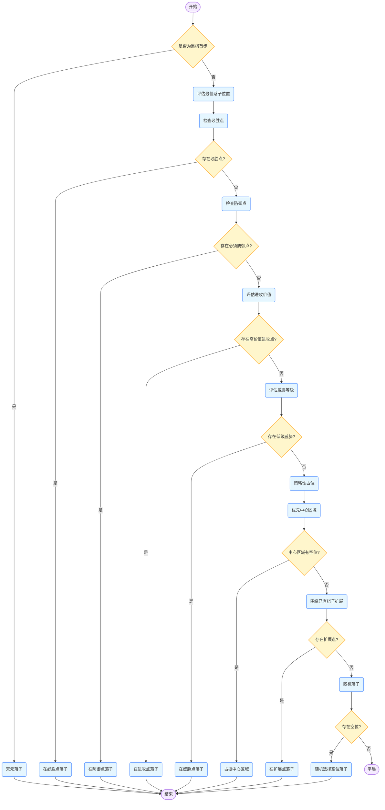
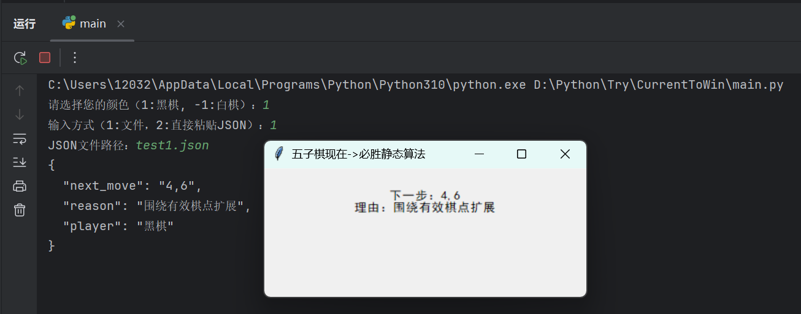

# 现在到必胜算法

## **算法概述**
本算法为寻找五子棋最优策略而服务，通过以下三个部分来实现：
1. **WinStrategy** - 包含五子棋核心逻辑，可加载棋盘数据、更新玩家信息并进行威胁检测和阵法匹配，运行时会遍历当前棋盘及其镜像的四个方向，确保算法的正常实现
2. **WinningPart** - 涵盖13种黑棋的强攻阵法和8种白棋的反击阵法，每个阵法含3~5个由数组对应的棋盘状态，基于这些阵法给出建议落子位置及理由
3. **main** - 负责初始化程序并开始执行，提供阵营及json输入方式的选择，读取及处理数据，提供输出弹窗
---
## **运作逻辑**

---
## **算法实现细节**  
### **数据结构**  
-**棋盘表示：** 使用`9×9`的二维数组表示棋盘，其中`0`表示空位，`1`表示黑棋，`-1`表示白棋  
-**Json格式：** 输入输出均为Json格式，方便与外部系统集成
### **关键算法**  
-**威胁检测算法：** 扫描棋盘上的每行，检测是否存在冲四、活四、活三等威胁模式  
-**阵法匹配算法：** 将当前棋盘状态与预定义阵法进行匹配，支持四向旋转和镜像对称  
### **坐标转换**  
-**数组坐标转数学坐标：** 将内部使用的数组坐标（行，列）转换为数学坐标（x, y），其中x表示列索引加1，y表示9减去行索引  

---
## **运行示例**  
**输入示例**  
```json
{
    "board": [
        [0,0,0,0,0,0,0,0,0],
        [0,0,0,0,0,0,0,0,0],
        [0,0,0,0,0,0,0,0,0],
        [0,0,0,0,0,0,0,0,0],
        [0,0,0,0,1,-1,0,0,0],
        [0,0,0,0,0,0,0,0,0],
        [0,0,0,0,0,0,0,0,0],
        [0,0,0,0,0,0,0,0,0],
        [0,0,0,0,0,0,0,0,0]
    ]
}
```
**输出示例**  



