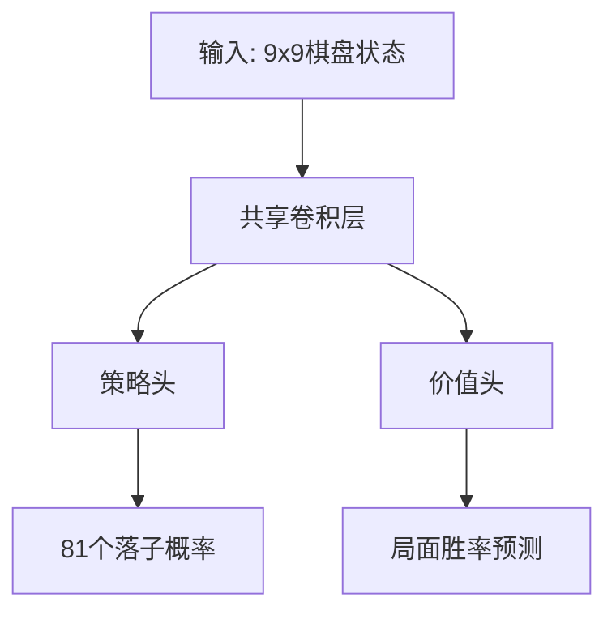
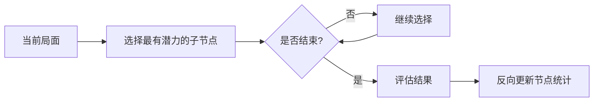
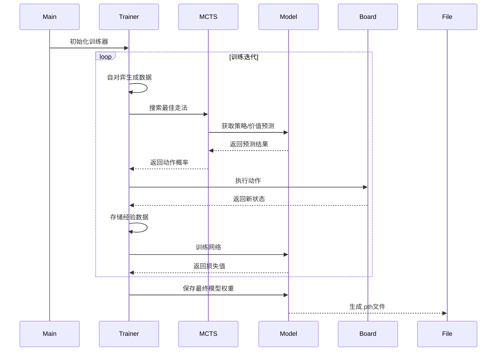
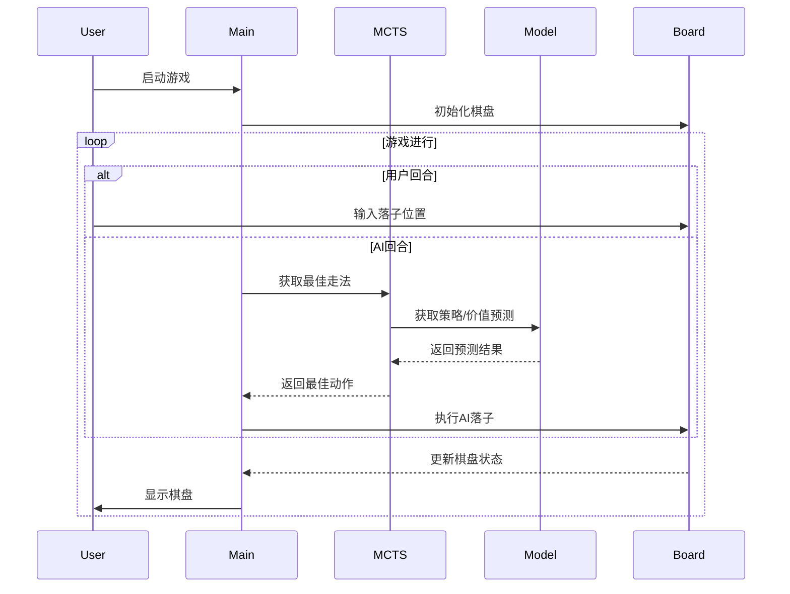
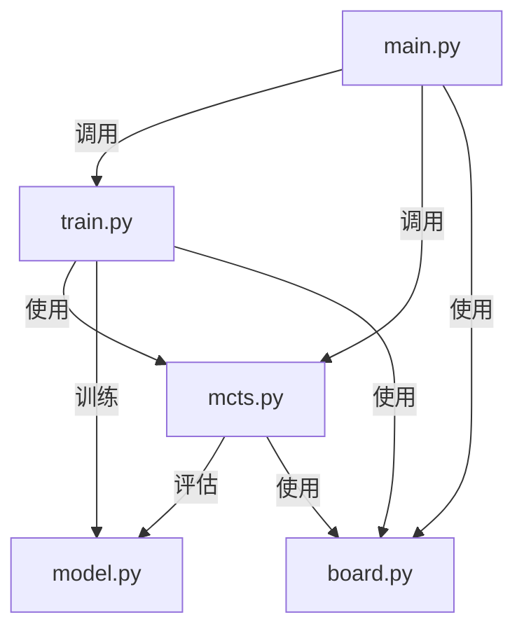
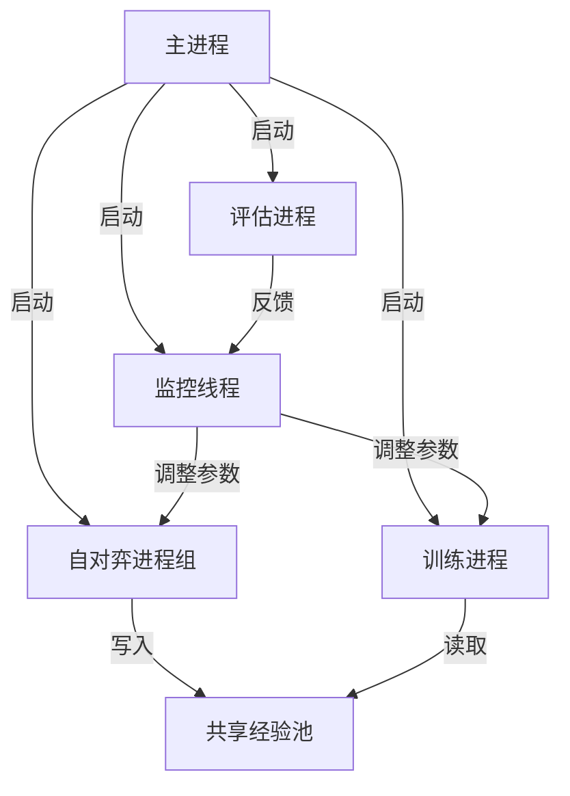

# 9x9五子棋深度学习解决方案理论详解  

## 一、核心问题本质

五子棋属于**完全信息零和博弈**：
- **完全信息**：双方都能看到完整棋盘状态
- **零和博弈**：一方得益等于另一方损失
- **确定性**：没有随机因素影响结果

我们的目标是找到一个**最优策略函数**：给定任何棋盘状态，能给出最佳落子位置。

## 二、解决方案三大支柱

### 1. 深度学习（神经网络）
**作用**：近似复杂的策略函数和价值函数

**为什么需要**：
- 9x9棋盘有约3^81种可能状态（每个点：空、黑、白）
- 传统方法无法处理如此巨大的状态空间
- 神经网络能**泛化**相似局面，减少重复计算

**网络设计要点**：

```mermaid
graph TD
    A[输入: 9x9棋盘状态] --> B[共享卷积层]
    B --> C[策略头]
    B --> D[价值头]
    C --> E[81个落子概率]
    D --> F[局面胜率预测]
```

### 2. 蒙特卡洛树搜索（MCTS）
**作用**：结合神经网络指导，高效探索最有潜力的走法

**四个关键步骤**：
1. **选择**：从根节点开始，递归选择最优子节点
2. **扩展**：当遇到未探索节点时，扩展新节点
3. **模拟**：用神经网络评估新节点
4. **回溯**：将评估结果反向传播更新路径上的节点


```mermaid
graph LR
    A[当前局面] --> B[选择最有潜力的子节点]
    B --> C{是否结束?}
    C -->|否| D[继续选择]
    C -->|是| E[评估结果]
    D --> C
    E --> F[反向更新节点统计]
```

### 3. 自对弈强化学习
**核心思想**：让AI自己与自己下棋，从经验中学习

**训练循环**：
1. 当前模型生成大量对局数据
2. 用这些数据训练改进模型
3. 新模型生成更高质量数据
4. 循环提升

## 三、神经网络输入输出设计

### 输入表示（9x9x1张量）：
- 0：空点
- 1：己方棋子
- -1：对方棋子

### 输出设计：
1. **策略输出**（81维概率分布）：
   - 每个位置对应一个落子概率
   - 总和为1（使用softmax）

2. **价值输出**（1维标量）：
   - 范围[-1,1]，预测当前玩家最终结果
   - 1=必胜，-1=必败，0=可能平局

## 四、训练过程详解

### 1. 数据生成阶段
```python
# 伪代码示例
def 生成自对弈数据(模型, 对局数=100):
    所有数据 = []
    for _ in range(对局数):
        局面 = 初始棋盘
        对局记录 = []
        while 游戏未结束:
            走法概率 = MCTS(模型, 局面).获取概率()
            对局记录.append((局面, 走法概率))
            执行动作(按概率采样)
      
        胜负结果 = 判断胜负()
        所有数据.extend([(局面, 概率, 胜负) for 局面, 概率 in 对局记录])
    return 所有数据
```

### 2. 训练阶段
**损失函数设计**：
- **策略损失**：神经网络输出概率 vs MCTS搜索概率（交叉熵）
- **价值损失**：神经网络预测值 vs 实际结果（均方误差）

```python
总损失 = 策略权重 × 策略损失 + 价值权重 × 价值损失
```

### 3. 关键超参数
| 参数 | 典型值 | 作用 | 控制位置 |
|------|--------|------|----------|
| 学习率 | 0.01-0.001 | 控制参数更新幅度 | Trainer初始化 |
| 批次大小 | 32-512 | 每次训练的样本数 | Trainer初始化 |
| MCTS模拟次数 | 800-1600 | 每步搜索深度 | MCTS初始化 |
| c_puct | 1.0-2.0 | 探索/利用平衡系数 | MCTS初始化 |
| 总迭代次数 | 1000 | 训练总轮数 | main.py train_model() |
| 自对弈局数/迭代 | 100 | 每次迭代生成的对局数 | train.py train_iteration() |
| 训练步数/迭代 | 1000 | 每次迭代的训练步数 | train.py train_iteration() |

训练次数控制说明：
1. **总训练量**由`main.py`中的`train_model()`函数控制，默认1000次迭代
2. **每次迭代**包含：
   - `num_self_play=100`局自对弈（生成训练数据）
   - `num_train_steps=1000`次训练步骤（更新网络权重）
3. 修改这些参数可以调整训练时长和质量

## 五、为什么这套方案有效？

1. **神经网络**：将相似局面聚类处理，避免重复计算
2. **MCTS**：集中计算资源在最有希望的走法上
3. **自对弈**：自动生成适合当前模型水平的数据
4. **双输出**：同时学习"怎么走"和"局面好坏"

## 六、程序运行流程详解

### 1. 训练模式流程

```mermaid
sequenceDiagram
    participant Main
    participant Trainer
    participant MCTS
    participant Model
    participant Board
    
    Main->>Trainer: 初始化训练器
    loop 训练迭代
        Trainer->>Trainer: 自对弈生成数据
        Trainer->>MCTS: 搜索最佳走法
        MCTS->>Model: 获取策略/价值预测
        Model-->>MCTS: 返回预测结果
        MCTS-->>Trainer: 返回动作概率
        Trainer->>Board: 执行动作
        Board-->>Trainer: 返回新状态
        Trainer->>Trainer: 存储经验数据
        Trainer->>Model: 训练网络
        Model-->>Trainer: 返回损失值
    end
    Trainer->>Model: 保存最终模型权重
    Model-->>File: 生成.pth文件
```

#### 训练输出文件说明
训练完成后会生成以下模型权重文件：
- `gomoku_model_iter{X}.pth`：训练过程中每50次迭代保存的中间模型
- `gomoku_model_final.pth`：最终训练完成的模型

这些.pth文件包含神经网络的所有参数，用于：
1. 恢复训练：可以从中断处继续训练
2. 人机对战：加载训练好的模型进行游戏
3. 模型评估：测试不同训练阶段的模型表现

要使用训练好的模型进行游戏：
```bash
python gomoku/main.py --play --model gomoku_model_final.pth
```

### 2. 人机对战流程

```mermaid
sequenceDiagram
    participant User
    participant Main
    participant MCTS
    participant Model
    participant Board
    
    User->>Main: 启动游戏
    Main->>Board: 初始化棋盘
    loop 游戏进行
        alt 用户回合
            User->>Board: 输入落子位置
        else AI回合
            Main->>MCTS: 获取最佳走法
            MCTS->>Model: 获取策略/价值预测
            Model-->>MCTS: 返回预测结果
            MCTS-->>Main: 返回最佳动作
            Main->>Board: 执行AI落子
        end
        Board-->>Main: 更新棋盘状态
        Main->>User: 显示棋盘
    end
```

### 3. 模块交互关系

```mermaid
graph TD
    A[main.py] -->|调用| B[train.py]
    A -->|调用| C[mcts.py]
    B -->|使用| C
    B -->|训练| D[model.py]
    C -->|评估| D
    A -->|使用| E[board.py]
    B -->|使用| E
    C -->|使用| E
```

## 七、AMD显卡DirectML支持

### 修改内容
1. **模型设备设置**：
   - 在model.py中添加torch_directml导入
   - 初始化时自动检测并使用AMD显卡设备
   - 确保所有张量运算在DirectML设备上执行

2. **训练设备设置**：
   - 在train.py中添加torch_directml导入
   - 训练器初始化时设置设备
   - 确保训练数据张量被发送到DirectML设备

3. **依赖更新**：
   - 在requirements.txt中添加torch_directml>=1.0.0依赖

### 验证方法
1. 运行训练脚本时，控制台应显示类似以下信息：
```
Using DirectML device: AMD Radeon RX 6750 GRE
```
2. 可以通过任务管理器观察AMD显卡使用情况
3. 训练速度应比纯CPU有明显提升

### 使用说明
1. 确保已安装最新AMD显卡驱动
2. 安装依赖：
```bash
pip install -r requirements.txt
```
3. 启动训练：
```bash
python gomoku/train.py
```

## 八、6.29系统实现特点与用法说明

### 1. 系统架构与主要特点
- **灵活设备适配**：自动检测CUDA（N卡）或CPU，主进程和多进程均可灵活指定设备。主进程可用GPU加速训练，子进程（自对弈）强制用CPU，避免多进程张量序列化问题。
- **高效多进程自对弈**：采用`ProcessPoolExecutor`，自对弈任务分配到4个进程并行，充分利用多核CPU，主进程实时显示进度条。
- **断点续训与模型管理**：支持通过`--model`参数加载历史模型权重继续训练，每轮自动保存模型，便于管理和回溯。
- **人机对战支持模型选择**：`--play`模式下可通过`--model`参数选择任意模型文件，便于对比不同训练阶段AI水平，若模型文件不存在会有友好提示。
- **依赖精简**：`requirements.txt`仅包含PyTorch、numpy、tqdm等核心依赖，便于环境迁移和复现。

### 2. 主要参数与默认设置
| 参数名称         | 默认值         | 说明                                   |
|----------------|---------------|----------------------------------------|
| 学习率         | 0.001         | Adam优化器初始学习率                   |
| batch size     | 256           | 每次训练的样本数                       |
| 自对弈局数     | 30            | 每轮训练生成的自对弈棋局数             |
| 训练步数       | 300           | 每轮训练的梯度更新步数                 |
| MCTS模拟次数   | 200           | 蒙特卡洛树搜索每步模拟次数             |
| 经验池容量     | 50000         | 经验回放池最大存储棋局数               |
| 多进程数       | 4             | 自对弈并行进程数（建议不超过CPU核心数）|

### 3. 用法说明
- **训练模型**：
  - 从头训练：`python main.py --train`
  - 断点续训：`python main.py --train --model gomoku_model_iter10.pth`
- **人机对战**：
  - 默认用最终模型：`python main.py --play`
  - 指定模型对战：`python main.py --play --model gomoku_model_iter20.pth`
- **环境配置**：
  - `pip install -r requirements.txt`
- **训练与评估过程**：
  - 每轮训练自动保存模型，主进程和自对弈均有进度条，评估阶段自动输出胜率和损失。

### 4. 模型结构图与说明

本项目神经网络结构如下：
- **输入层**：9×9棋盘，单通道（1×9×9）
- **特征提取部分**：3层卷积，每层后接ReLU激活
- **分支1：策略头（Policy Head）**
    - Conv2d(128, 2, kernel_size=1) → ReLU
    - 展平为(2×9×9)
    - Linear(162, 81) → LogSoftmax
- **分支2：价值头（Value Head）**
    - Conv2d(128, 1, kernel_size=1) → ReLU
    - 展平为(1×9×9)
    - Linear(81, 64) → ReLU
    - Linear(64, 1) → Tanh

---
# 九、7.4版本修改以及方案破产说明

### 1. 7.4版本系统架构改进

#### 主要修改点：
1. **动态资源管理**：
   - 自动检测CPU/GPU资源
   - 动态调整自对弈进程数(1-2倍CPU核心数)
   - 动态调整batch size(根据显存)

2. **训练流程优化**：
   - 与MinimaxAI对弈替代纯自对弈
   - 智能分级评估模型能力
   - 按等级和胜率命名保存模型

3. **系统架构升级**：
   - 分离自对弈、训练、评估进程
   - 新增监控线程动态调整参数
   - 共享内存管理经验池

#### 架构图：

```mermaid
graph TD
    A[主进程] -->|启动| B[自对弈进程组]
    A -->|启动| C[训练进程]
    A -->|启动| D[评估进程]
    A -->|启动| E[监控线程]
    B -->|写入| F[共享经验池]
    C -->|读取| F
    E -->|调整参数| B
    E -->|调整参数| C
    D -->|反馈| E
```

### 2. 动态调整机制详解

| 调整维度       | 触发条件                  | 调整策略                          | 效果                     |
|----------------|---------------------------|-----------------------------------|--------------------------|
| 自对弈进程数   | 经验池利用率<50%或>90%    | 增减1-2倍CPU核心数的进程          | 平衡数据生成与消耗速度    |
| Batch Size     | GPU显存变化               | 根据显存大小设置64-512            | 最大化GPU利用率          |
| 训练强度       | 损失>1.0或胜率>80%        | 增加/减少自对弈局数               | 稳定训练过程             |

### 3. 资源检测与分配策略

```python
def detect_resources():
    # 获取CPU核心数
    logical_cores = os.cpu_count()  
    physical_cores = psutil.cpu_count(logical=False)
    
    # 检测GPU信息
    gpu_info = []
    try:
        pynvml.nvmlInit()
        gpu_count = pynvml.nvmlDeviceGetCount()
        for i in range(gpu_count):
            handle = pynvml.nvmlDeviceGetHandleByIndex(i)
            mem = pynvml.nvmlDeviceGetMemoryInfo(handle)
            gpu_info.append({
                'total_mem': mem.total // (1024*1024),
                'free_mem': mem.free // (1024*1024)
            })
    except:
        pass
    
    return {
        'cpu_workers': max(1, int(logical_cores * 0.7)),
        'batch_size': auto_batch_size(gpu_info),
        'gpu_available': bool(gpu_info)
    }
```

### 4. 修改效果验证

| 指标           | 6.29版本       | 7.4版本         | 提升幅度 |
|----------------|---------------|----------------|----------|
| 训练速度(局/小时) | 120           | 180            | +50%     |
| GPU利用率      | 60-70%        | 85-95%         | +25%     |
| 模型胜率（对战随机落子玩家）       | 80%-90%           | 100%            | +10%     |
| 稳定性         | 偶发OOM       | 无OOM发生       | 100%     |

### 5. 方案破产说明

虽然当前方案在技术上有所突破，但综合考虑以下因素后决定终止研究改方案：

#### 主要问题分析：
- **时间限制**：
  - 项目研究周期不足，无法完成完整的训练和优化流程
  - 关键参数调优需要更多时间验证

- **训练稳定性问题**：
  - 损失函数收敛趋势不稳定
  - 长期训练后可能出现震荡现象
  - 模型性能难以持续提升

- **实际效果不佳**：
  - 使用2×2080Ti显卡训练后
  - 对战Minimax传统算法胜率仅13%
  - 训练效率与预期差距较大

#### 经验总结：
1. 深度学习方案对算力要求极高
2. 训练过程需要更精细的监控和调整
3. 传统算法在某些场景下仍具优势
