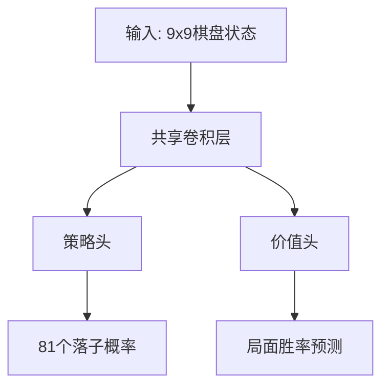
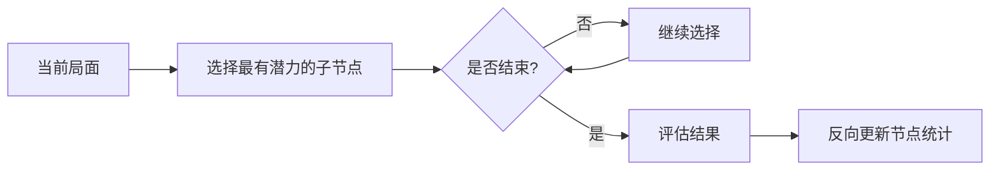
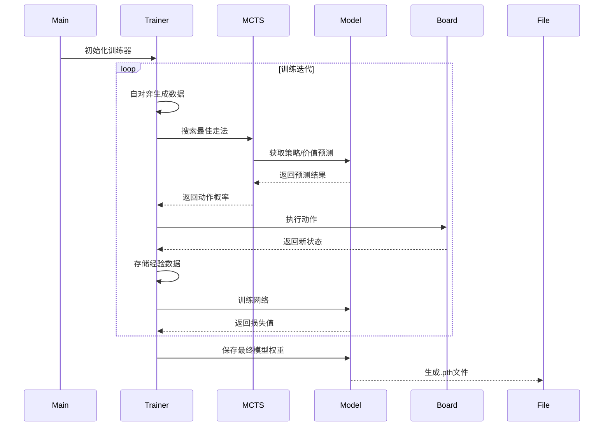
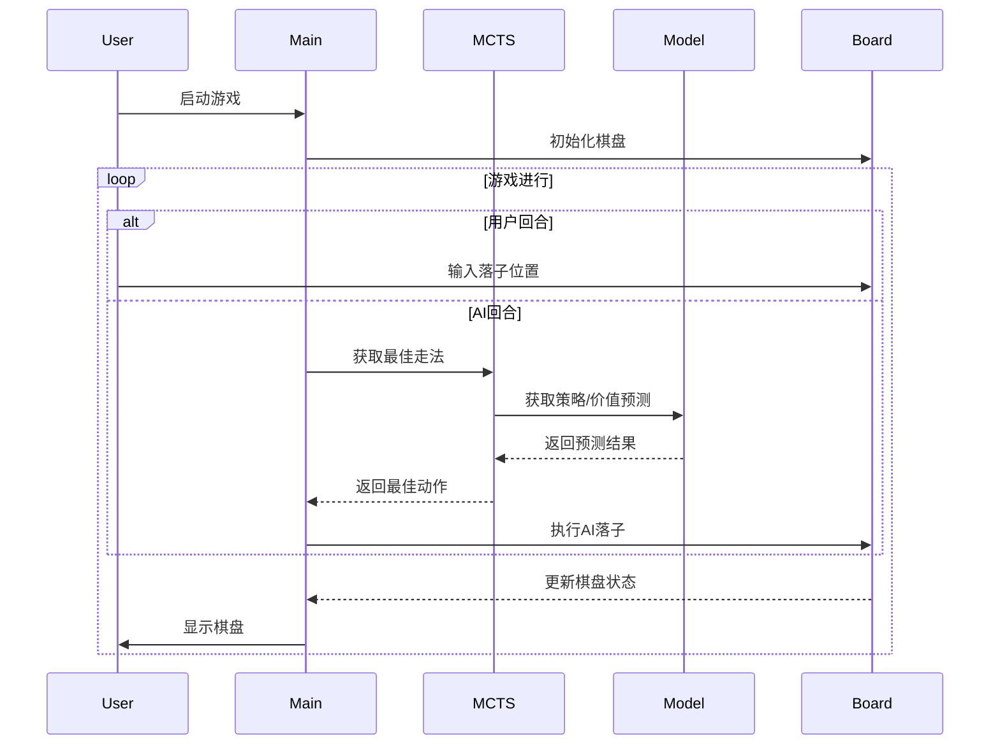
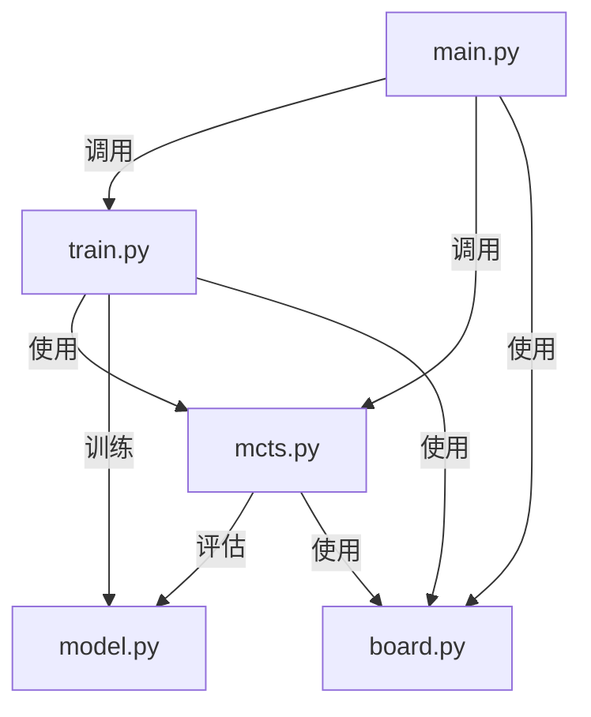

# 9x9五子棋深度学习解决方案理论详解  

## 一、核心问题本质

五子棋属于**完全信息零和博弈**：
- **完全信息**：双方都能看到完整棋盘状态
- **零和博弈**：一方得益等于另一方损失
- **确定性**：没有随机因素影响结果

我们的目标是找到一个**最优策略函数**：给定任何棋盘状态，能给出最佳落子位置。

## 二、解决方案三大支柱

### 1. 深度学习（神经网络）
**作用**：近似复杂的策略函数和价值函数

**为什么需要**：
- 9x9棋盘有约3^81种可能状态（每个点：空、黑、白）
- 传统方法无法处理如此巨大的状态空间
- 神经网络能**泛化**相似局面，减少重复计算

**网络设计要点**：


### 2. 蒙特卡洛树搜索（MCTS）
**作用**：结合神经网络指导，高效探索最有潜力的走法

**四个关键步骤**：
1. **选择**：从根节点开始，递归选择最优子节点
2. **扩展**：当遇到未探索节点时，扩展新节点
3. **模拟**：用神经网络评估新节点
4. **回溯**：将评估结果反向传播更新路径上的节点



### 3. 自对弈强化学习
**核心思想**：让AI自己与自己下棋，从经验中学习

**训练循环**：
1. 当前模型生成大量对局数据
2. 用这些数据训练改进模型
3. 新模型生成更高质量数据
4. 循环提升

## 三、神经网络输入输出设计

### 输入表示（9x9x1张量）：
- 0：空点
- 1：己方棋子
- -1：对方棋子

### 输出设计：
1. **策略输出**（81维概率分布）：
   - 每个位置对应一个落子概率
   - 总和为1（使用softmax）

2. **价值输出**（1维标量）：
   - 范围[-1,1]，预测当前玩家最终结果
   - 1=必胜，-1=必败，0=可能平局

## 四、训练过程详解

### 1. 数据生成阶段
```python
# 伪代码示例
def 生成自对弈数据(模型, 对局数=100):
    所有数据 = []
    for _ in range(对局数):
        局面 = 初始棋盘
        对局记录 = []
        while 游戏未结束:
            走法概率 = MCTS(模型, 局面).获取概率()
            对局记录.append((局面, 走法概率))
            执行动作(按概率采样)
      
        胜负结果 = 判断胜负()
        所有数据.extend([(局面, 概率, 胜负) for 局面, 概率 in 对局记录])
    return 所有数据
```

### 2. 训练阶段
**损失函数设计**：
- **策略损失**：神经网络输出概率 vs MCTS搜索概率（交叉熵）
- **价值损失**：神经网络预测值 vs 实际结果（均方误差）

```python
总损失 = 策略权重 × 策略损失 + 价值权重 × 价值损失
```

### 3. 关键超参数
| 参数 | 典型值 | 作用 | 控制位置 |
|------|--------|------|----------|
| 学习率 | 0.01-0.001 | 控制参数更新幅度 | Trainer初始化 |
| 批次大小 | 32-512 | 每次训练的样本数 | Trainer初始化 |
| MCTS模拟次数 | 800-1600 | 每步搜索深度 | MCTS初始化 |
| c_puct | 1.0-2.0 | 探索/利用平衡系数 | MCTS初始化 |
| 总迭代次数 | 1000 | 训练总轮数 | main.py train_model() |
| 自对弈局数/迭代 | 100 | 每次迭代生成的对局数 | train.py train_iteration() |
| 训练步数/迭代 | 1000 | 每次迭代的训练步数 | train.py train_iteration() |

训练次数控制说明：
1. **总训练量**由`main.py`中的`train_model()`函数控制，默认1000次迭代
2. **每次迭代**包含：
   - `num_self_play=100`局自对弈（生成训练数据）
   - `num_train_steps=1000`次训练步骤（更新网络权重）
3. 修改这些参数可以调整训练时长和质量

## 五、为什么这套方案有效？

1. **神经网络**：将相似局面聚类处理，避免重复计算
2. **MCTS**：集中计算资源在最有希望的走法上
3. **自对弈**：自动生成适合当前模型水平的数据
4. **双输出**：同时学习"怎么走"和"局面好坏"

## 六、程序运行流程详解

### 1. 训练模式流程


#### 训练输出文件说明
训练完成后会生成以下模型权重文件：
- `gomoku_model_iter{X}.pth`：训练过程中每50次迭代保存的中间模型
- `gomoku_model_final.pth`：最终训练完成的模型

这些.pth文件包含神经网络的所有参数，用于：
1. 恢复训练：可以从中断处继续训练
2. 人机对战：加载训练好的模型进行游戏
3. 模型评估：测试不同训练阶段的模型表现

要使用训练好的模型进行游戏：
```bash
python gomoku/main.py --play --model gomoku_model_final.pth
```

### 2. 人机对战流程


### 3. 模块交互关系

