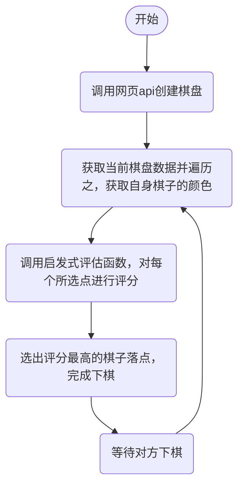
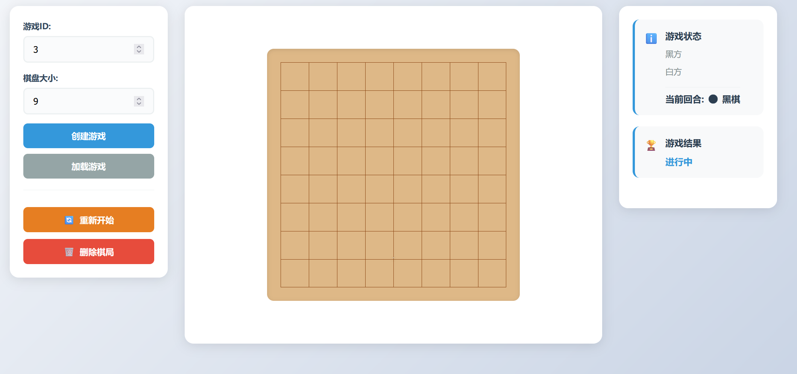
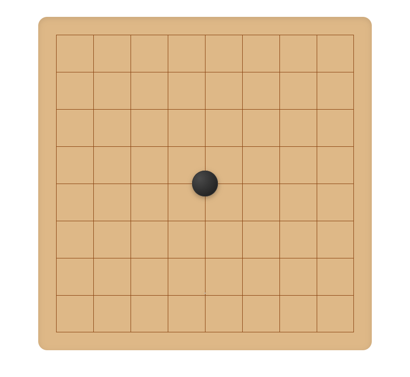
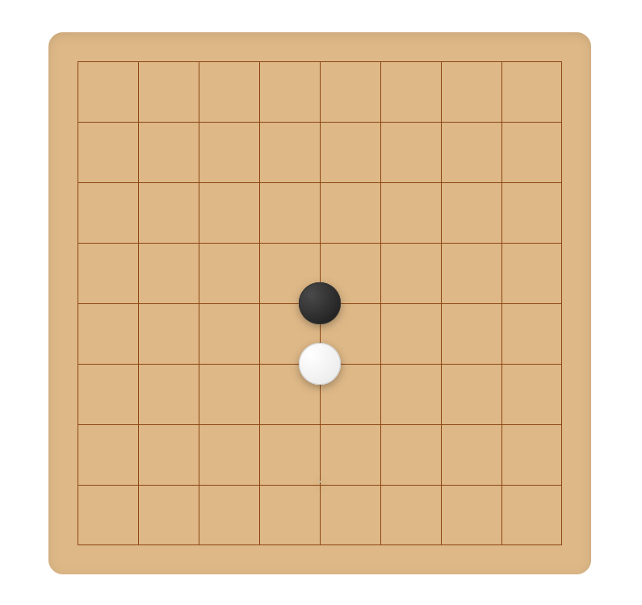

# 启发式算法
## 一、核心问题本质

五子棋属于**完全信息零和博弈**：
- **完全信息**：双方都能看到完整棋盘状态
- **零和博弈**：一方得益等于另一方损失
- **确定性**：没有随机因素影响结果

我们的目标是找到一个**最优策略函数**：给定任何棋盘状态，能给出最佳落子位置。

## 二、启发式算法中主要的类，一共有四个部分
1. **JsonWenJian** - 为录入json文件的类，通过录入json文件棋盘来进行分析
2. **EvaluateTime** - 为评估五子棋各个位置的评分设置的类，是程序的核心部件
3. **Test** - 为程序的程序入口，致力于在这里通过调谐另外两个类达成完成五子棋下棋措施
4. **KeHuDuan** - 为程序的与前端网页api接口的连接类，在这个类中，可以通过程序读取网页数据然后下棋

通过这几个类，我们便可以完成五子棋下棋程序的全部内容，包括**读取**，**下棋**，**输出**三大板块
## 三、算法运行流程

## 四、算法细节
**棋盘** - 在算法的棋盘表示中，采用9*9的二维数组来表示棋盘，用0表示空位，1表示黑棋，-1表示白棋
**数据录入与输出** - 通过读取指定接口的网站来录入棋盘，然后经过一系列评估后使用坐标来进行下棋
**数据转换** - 通过C#内部的类来将json文件转化为String字符串，然后再将字符串转化为二维int数组，来达到方便运行的目的
**评估处理** - 按照不同的棋子组合有不同的评分的机制，为限定了一定范围的空位选择进行评估，将得分相加，最后得到总分

## 五、核心算法启发式函数**EvaluateTime**详解
**评分系统**- 在启发式函数中，我将各种五子棋阵型都设置了一个分数：
*双通二连*：8分 *单通二连*：2分 
*双通三连*：100分 *单通三连*：10分
*双通四连*：10000分 *单通四连*：100分 
*双通五连*：100000分 
通过给不同阵型设置不同的分，且高价值阵型的分数与低价值阵型的分数相差极大，让其拥有极高的优先级，不会被多个低价值阵型所迷惑导致错失胜利的时机
**遍历设置** - 有了评分系统那接下来就是遍历系统，在此程序中，我的遍历设置是先选定一个点，模拟在此处下棋，然后遍历其四个方向前后共32个点，最后统计其是什么形状的阵型，有没有被阻挡

## 六、运行示例
**创建棋盘**
>
**输入示例**  

**输出示例**


## 七、算法评估
**优点**
1. 这套算法的运行较为稳定，在大多数场合中能够完成下棋的任务，并且不会出现致命的缺陷和失误
2. 程序简洁，原理较为简单，容易理解
3. 运行效率很快，可以在很短的时间中给出一个较为合适的下棋选择
**缺点**
1. 可能对于某些特殊情况比较难以应对，无法得到最好的解法
2. 下棋偏向防守，进攻性比较低

## 八、实验报告的补充和更新说明

### **6.27程序设计报告**
经过多方资料查询和思考，得到了完成程序的灵感，开始着手建立**Test**类还有**JsonWenJian**类
在**JsonWenJian**类中，查询了C#中有关各种文件读取和录入的资料，通过**using System.Text.Json**来完成了json文件的录入，并在函数中完成了json文件向string变量的转换
然后在录入的string变量中筛选出所需要的五子棋棋盘，将其转换为int[,]类型的数组，返回到主函数
在**Test**类接收到棋盘后，便开始着手进行构建计算当前落子颜色的函数，以便确认当前应谁落子

### ***6.28程序设计报告**
在完成了部分的**Test**类后，着手开始建立最为重要的**EvaluateTime**类，在这个函数中设立了最为重要的**评分系统**和**遍历设置**
随后便在**Test**类中调用这个已完成的类，将需要遍历的点位都传入进去
最后使用了结构体
```
    struct MaxNum
    {
        public int sc;
        public int x;
        public int y;
    }
```
来储存经过评估得到分数最高的点位，最后输出出去

### ***7.4程序设计报告**
开始着手建立**KeHuDuan**类，以将程序于前端网页连接起来，完成数据的互传
在构建期间不断的调试，最终完成了能够向接口发送请求的**KeHuDuan**类
随后便开始更改**JsonWenJian**类中读取json文件的方式，从读取一个指定的文件变成了读取网页结构返回的json文件
最后完善了**Test**类的一些缺陷，将原本的读取和输出都与前端相关联起来，使其能够监视网页中对手的下棋情况还有对当前局势的分析