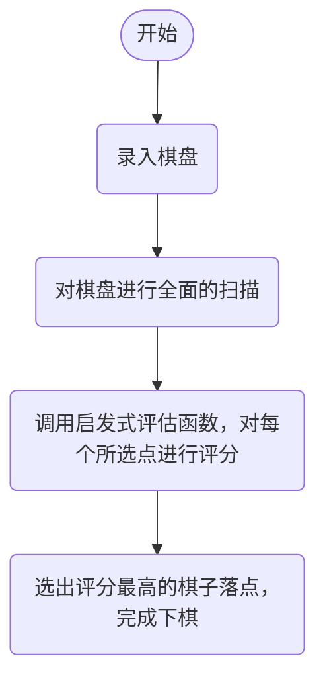

# 启发式算法
## 启发式算法中主要的类，一共有三个部分
1. **JsonWenJian** - 为录入json文件的类，通过录入json文件棋盘来进行分析
2. **EvaluateTime** - 为评估五子棋各个位置的评分设置的类，是程序的核心部件
3. **Test** - 为程序的程序入口，致力于在这里通过调谐另外两个类达成完成五子棋下棋措施
## 算法运行流程

## 算法细节
**棋盘**  在算法的棋盘表示中，采用9*9的二维数组来表示棋盘，用0表示空位，1表示黑棋，-1表示白棋
**数据录入与输出** 通过读取指定json文件的来录入棋盘，然后经过一系列评估后使用坐标来进行下棋
**数据转换** 通过C#内部的类来将json文件转化为String字符串，然后再将字符串转化为二维int数组，来达到方便运行的目的
**评估处理** 按照不同的棋子组合有不同的评分的机制，为限定了一定范围的空位选择进行评估，将得分相加，最后得到总分 
## **运行示例**  
**输入示例**  
```json
{
    "board": [
        [0,0,0,0,0,0,0,0,0],
        [0,0,0,0,0,0,0,0,0],
        [0,0,0,0,0,0,0,0,0],
        [0,0,0,0,0,0,0,0,0],
        [0,0,0,0,1,0,0,0,0],
        [0,0,0,0,0,0,0,0,0],
        [0,0,0,0,0,0,0,0,0],
        [0,0,0,0,0,0,0,0,0],
        [0,0,0,0,0,0,0,0,0]
    ]
}
```
**输出示例**

