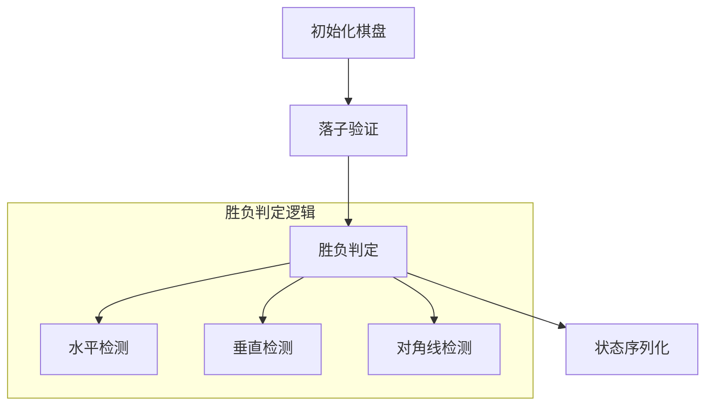
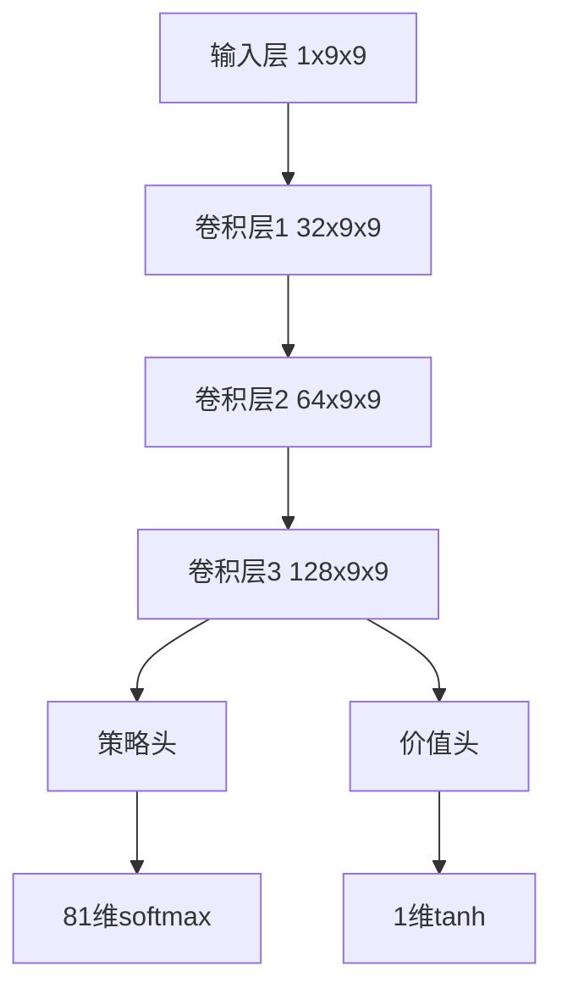
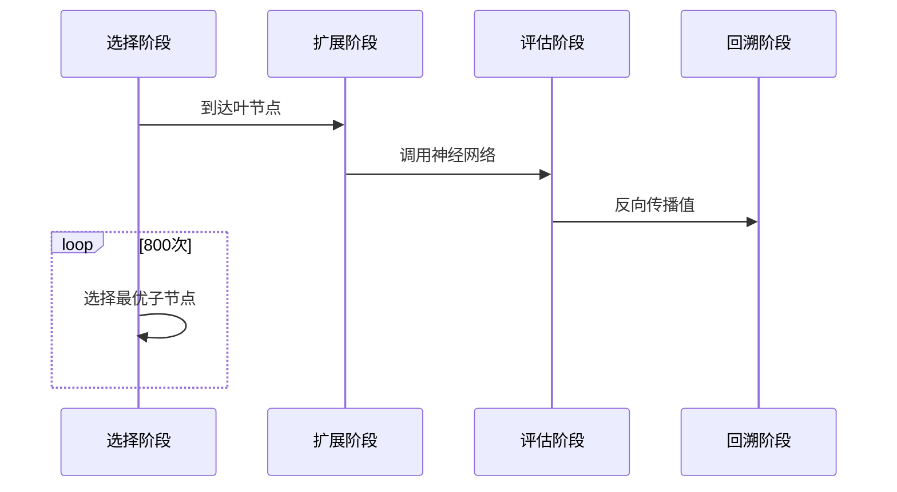
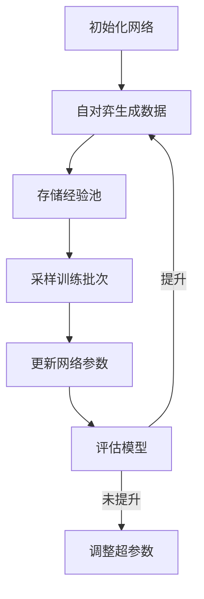

# 9x9五子棋深度学习系统设计文档

## 1. 系统概述

本系统采用AlphaZero架构实现9x9五子棋的智能对弈，包含以下核心组件：
- 神经网络模型（策略/价值双输出）
- 蒙特卡洛树搜索（MCTS）
- 自对弈训练循环
- 对战接口

## 2. 数据格式规范

### 2.1 输入数据格式
```typescript
interface BoardState {
  board: number[][]; // 9x9矩阵
  currentPlayer?: number; // 可选，默认为1
}

// 示例：
const input: BoardState = {
  board: [
    [0,0,0,0,0,0,0,0,0],
    [0,0,1,0,0,0,0,0,0],
    [0,0,-1,1,0,0,0,0,0],
    [0,0,-1,0,1,0,0,0,0],
    [0,0,-1,0,0,1,0,0,0],
    [0,0,0,0,0,0,0,0,0],
    [0,0,0,0,0,0,0,0,0],
    [0,0,0,0,0,0,0,0,0],
    [0,0,0,0,0,0,0,0,0]
  ]
};
```

### 2.2 输出数据格式
#### 神经网络原始输出：
```typescript
interface ModelOutput {
  policy: number[]; // 81维概率向量
  value: number; // [-1,1]区间
}
```

#### MCTS搜索输出：
```typescript
interface MCTSOutput {
  actionProbs: number[]; // 81维标准化概率
  bestAction: number; // 0-80的整数
  rootValue: number; // 根节点评估值
}
```

## 3. 详细实现步骤

### 阶段1：环境准备 (Day 1-2)

#### 1.1 棋盘逻辑实现


**输入/输出规范：**
- `makeMove(row,col)`：返回是否成功
- `checkWin(row,col)`：返回1(胜)/-1(负)/0(继续)
- `getValidMoves()`：返回可用位置列表

### 阶段2：神经网络实现 (Day 3-5)

#### 2.1 网络架构


**训练数据格式：**
```typescript
interface TrainingSample {
  state: BoardState;
  policyTarget: number[];
  valueTarget: number;
}
```

### 阶段3：MCTS实现 (Day 6-8)

#### 3.1 搜索流程


**关键参数：**
- c_puct = 1.5
- 模拟次数 = 800
- 温度τ: 训练=1.0, 测试=0.1

### 阶段4：训练循环 (Day 9-14)

#### 4.1 自对弈流程


**数据生成规范：**
- 每局保存所有(state, π, z)元组
- 经验池容量 = 50,000局
- 批次大小 = 512

### 阶段5：接口封装 (Day 15)

#### 5.1 对外接口设计
```typescript
interface GomokuAI {
  // 获取下一步建议
  getMove(state: BoardState): {
    action: number; // 0-80
    probs: number[]; // 81维
    thinkingTime: number;
  };

  // 训练迭代
  trainIteration(): {
    loss: number;
    winRate: number;
  };
}
```

## 4. 详细工作流程

### 4.1 单次决策流程
1. **接收请求**
   - 输入：`BoardState` JSON
   - 验证：检查棋盘有效性

2. **预处理**
   - 标准化：当前玩家始终为1
   - 张量转换：转为1x1x9x9 tensor

3. **MCTS搜索**
   ```python
   def run_mcts(root_state):
       for _ in range(800):
           node = root
           game = clone_game()
         
           # 选择
           while node.expanded():
               action = select_action(node)
               game.make_move(action//9, action%9)
               node = node.children[action]
         
           # 扩展/评估
           if not game.over:
               policy, value = model.predict(game.state)
               expand_node(node, policy)
           else:
               value = game.result
         
           # 回溯
           backpropagate(node, value)
     
       return get_action_probs(root)
   ```

4. **返回结果**
   - 输出：包含动作概率和最佳动作的JSON

### 4.2 训练迭代流程
1. **数据生成**
   - 并行运行100局自对弈
   - 每局保存所有中间状态

2. **训练步骤**
   ```python
   def train_step(batch):
       states, policies, values = prepare_batch(batch)
     
       # 前向传播
       pred_policies, pred_values = model(states)
     
       # 计算损失
       policy_loss = cross_entropy(pred_policies, policies)
       value_loss = mse(pred_values, values)
       total_loss = policy_loss + value_weight * value_loss
     
       # 反向传播
       optimizer.zero_grad()
       total_loss.backward()
       optimizer.step()
   ```

3. **评估**
   - 对阵上一版本模型（100局）
   - 计算胜率和ELO评分变化

## 5. 评估指标

| 指标 | 计算方法 | 目标值 |
|------|----------|--------|
| 策略准确率 | 与MCTS输出的KL散度 | < 0.2 |
| 价值误差 | 预测值与实际结果的MSE | < 0.05 |
| 思考时间 | 单步决策耗时 | < 3s |
| 胜率 | 对基准AI | > 95% |

## 6. 异常处理

| 异常情况 | 处理方案 |
|----------|----------|
| 非法输入 | 返回400错误和具体原因 |
| 长时思考 | 设置超时中断机制 |
| 训练发散 | 自动回滚到上一稳定版本 |
| 内存溢出 | 实现经验池的LRU淘汰 |

## 7. 交付清单

1. 棋盘逻辑模块
2. 神经网络实现
3. MCTS搜索模块
4. 训练管道脚本
5. REST API接口
6. 性能监控面板
7. 使用文档

## 8. 时间规划

| 阶段 | 天数 | 交付物 |
|------|------|--------|
| 基础实现 | 5 | 可运行的基础版本 |
| 训练优化 | 7 | 达到80%胜率的模型 |
| 接口完善 | 3 | 完整API文档 |
| 压力测试 | 2 | 性能报告 |
| 文档整理 | 3 | 用户/技术文档 |

本设计文档提供了从零开始实现系统的完整路线图，每个步骤都明确了输入输出规范和处理逻辑。建议按照阶段顺序实施，每个阶段完成后进行验证测试再进入下一阶段。