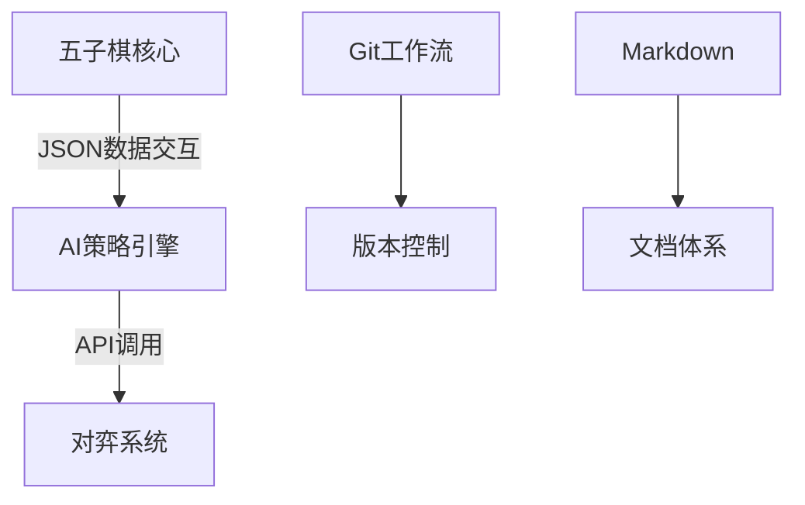

# 五子棋最优策略项目

## 项目概述
本项目旨在实现五子棋游戏的最优策略算法，通过以下三个核心模块协同推进：
1. **基础游戏实现** - 构建五子棋核心逻辑
2. **AI策略引擎** - 开发最优落子算法
3. **协作文档体系** - 标准化开发文档

## 技术架构


### 棋盘表示
使用 `n×n` 整型数组表示棋盘状态：
- `0`：空白位置
- `1`：黑子落子
- `-1`：白子落子

**示例棋盘状态**：
```json
{
  "board": [
    [0, 0, 0, 0, 0, 0],
    [0, 0, 1, 0, 0, 0],
    [0, 0, -1, 1, 0, 0],
    [0, 0, -1, 0, 1, 0],
    [0, 0, -1, 0, 0, 1],
    [0, 0, 0, 0, 0, 0]
  ]
}
```

## 协作规范
### Git工作流
1. 创建特性分支开发
2. 提交Pull Request(PR)
3. 代码审查后合并
4. 每日同步主分支

### 文档标准
- 所有文档使用Markdown格式
- API接口文档包含请求/响应示例
- 算法文档说明核心逻辑

## 开发路线
| 阶段        | 交付物                     | 时间节点   |
|-------------|----------------------------|------------|
| 核心实现    | 可运行的五子棋基础游戏     | 2025-06-30 |
| AI策略v1    | 基础对弈算法               | 2025-07-15 |
| 文档体系    | 完整API文档+使用指南       | 2025-07-20 |

## 环境配置
1. 克隆仓库：
```bash
git clone https://git.handywote.site/BestGameStrategyGroup/BestStrategyOfGomoku.git
```
2. ssh连接：
```bash
git remote add main ssh://git@git.handywote.site:2222/BestGameStrategyGroup/BestStrategyOfGomoku.git
```
需提前告知我把你的ssh公钥放到Gitea


> **重要提示**：请确保小组成员掌握Git基础操作和Markdown语法
