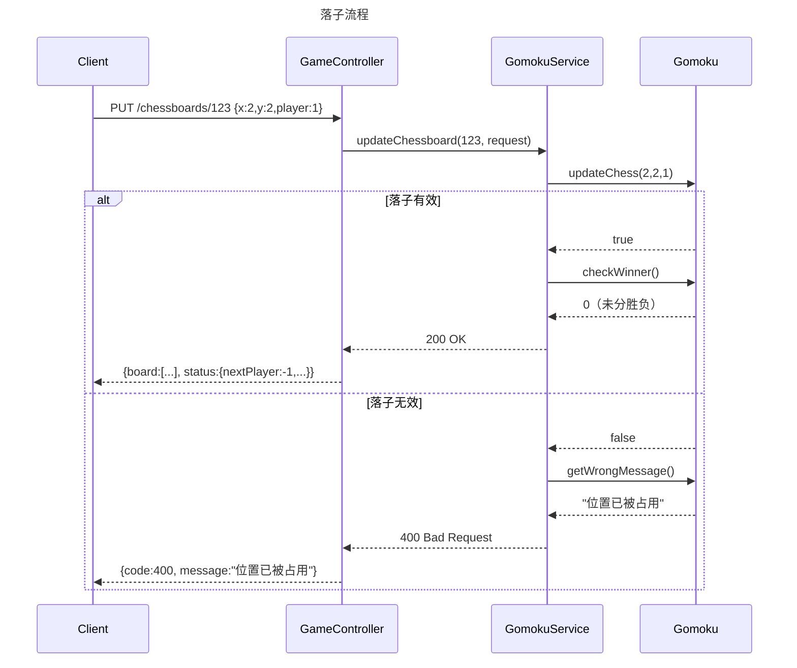

# 实践报告
我们小组选择的是游戏的最优策略这个话题，具体我们的游戏是9X9的五子棋的最优策略。
## 人员组成与分工
### 人员组成
|组长|组员|-|-|-|-|
|-|-|-|-|-|-|
|黄应辉|冯思语|郑逸驰|罗展彬|易雨杰|李金旺|
### 人员分工
* 罗展彬：前端JavaScript脚本，后端游戏控制器类、游戏请求类、游戏服务类
* 易雨杰：前端主页面、样式文件，后端五子棋的模型类

## 游戏设计
### 游戏规则
* 游戏默认使用9X9的棋盘，两名玩家轮流在棋盘上放置自己的棋子（黑子、白子）
* 黑子先行，每次只能在棋盘交界空白处落子
* 任意一方在横、竖、斜方向上连续五子即获胜，棋盘下满且无人获胜则为平局

### 后端设计思路
#### 五子棋系统流程图
```mermaid
graph TD
    A[GomokuApplication] -->|启动SpringBoot应用| B[GameController]
    
    subgraph REST API 层
        B --> C1["POST /chessboards<br/>创建棋局"]
        B --> C2["PUT /chessboards/{id}<br/>更新棋局"]
        B --> C3["GET /chessboards/{id}<br/>查询棋局"]
    end
     
    subgraph 请求处理
        C1 --> D[GomokuRequest]
        C2 --> D
        C3 --> D
        D -->|解析JSON| E[GomokuService]
    end
     
    subgraph 服务层
        E --> F1["createChessboard()<br/>• 初始化棋盘<br/>• 存储到HashMap"]
        E --> F2["updateChessboard()<br/>• 校验落子<br/>• 更新状态"]
        E --> F3["getChessboard()<br/>• 组装响应数据"]
    end
    
    subgraph 核心模型
        F1 --> G[Gomoku]
        F2 --> G
        F3 --> G
        G --> H1["int[][] board<br/>棋盘数据存储"]
        G --> H2["int checkWinner()<br/>• 五连检测<br/>• 平局判断"]
        G --> H3["boolean updateChess()<br/>• 边界校验<br/>• 重复落子检查"]
        G --> H4["String getWrongMessage()<br/>错误信息生成"]
    end
    
    subgraph 数据存储
        I["HashMap<Integer,Gomoku><br/>• key: 棋局ID<br/>• value: Gomoku实例"]
    end
    
    E -->|操作棋局数据| I
    G -->|读写状态| J["GameStatus<br/>• nextPlayer<br/>• isGameOver<br/>• winner"]
    
    style A fill:#F5F5DC,stroke:#333
    style B fill:#E6E6FA,stroke:#333
    style E fill:#FFE4B5,stroke:#333
    style G fill:#98FB98,stroke:#333
    style I fill:#AFEEEE,stroke:#333
 ```

#### 初始化
```mermaid

sequenceDiagram
    title 初始化流程
    participant Client
    participant GameController
    participant GomokuService
    participant Gomoku
    participant HashMap
    
    Client->>GameController: POST /chessboards {id:123,x:9,y:9}
    GameController->>GomokuService: createChessboard(request)
    GomokuService->>Gomoku: new Gomoku(9,9)
    Gomoku-->>GomokuService: 初始化9x9空棋盘
    GomokuService->>HashMap: put(123, gomoku)
    HashMap-->>GomokuService: 存储成功
    GomokuService-->>GameController: 返回201 Created
    GameController-->>Client: {id:123, board:[[0,...]], status:...}
```

#### 落子


### 关键数据结构
#### Gomoku类结构
 ```mermaid
classDiagram
    class Gomoku {
        - int[][] board
        - int currentPlayer
        - String wrongMessage
        + boolean updateChess(int x, int y, int player)
        + int checkWinner()
        + int[][] getChessboard()
    }
    class GameStatus {
        - int nextPlayer
        - boolean isGameOver
        - Integer winner
        - String message
    }
    Gomoku --> GameStatus : 读写状态
```

### API设计
* `POST /api/gomoku`：创建新棋盘或更新棋盘状态
  * 请求体：JSON格式，包含棋盘id、棋盘大小、棋盘数据等字段
  * 响应体：JSON格式，包含操作结果、当前玩家、游戏状态等信息
  * 使用示例：
    * 请求行与请求头
      ```
      POST http://localhost:10086/api/gomoku
      Content-Type: application/json
      ```
    * 请求体
      * 生成id为0的棋盘，棋盘大小为默认9*9
      ```json
      {
        "id": 0
      }
      ```
      * 生成id为0的棋盘，棋盘大小为15*15
      ```json
      {
        "id": 0,
        "x": 15,
        "y": 15
      }
      ```
      * 生成id为0的棋盘，导入棋盘数据
      ```json
      {
        "id": 0,
        "board": [
          [0, 0, 0, 0, 0, 0],
          [0, 0, 1, 0, 0, 0],
          [0, 0, -1, 1, 0, 0],
          [0, 0, -1, 0, 1, 0],
          [0, 0, -1, 0, 0, 1],
          [0, 0, 0, 0, 0, 0]
        ]
      }
      ```
    * 返回体
      ```json
      {
        "code": 0, //0为成功，-1为失败
        "msg": "提示成功/失败原因"  
      }
      ```
* `GET /api/gomoku/{id}`：获取指定棋盘的当前状态
  * 路径参数：棋盘id
  * 响应体：JSON格式，包含棋盘数据等信息
  * 使用示例：
    * 请求行与请求头
      * 获取id为0的棋盘数据
      ```
        GET http://localhost:10086/api/gomoku/0
        Content-Type: application/json
      ```
      * 添加参数showStatus=true 获取id为0的棋盘数据并显示游戏状态
      ```
        GET http://localhost:10086/api/gomoku/0?showStatus=true
        Content-Type: application/json
      ```
    * 响应体
    ```json
    {
      "code": 0, //0为成功，-1为失败
      "msg": "失败原因", //code为-1时输出
      "nextPlayer":1, //code为0时输出，1为轮到黑子出，-1为轮到白子出, showStatus参数为false时不输出
      "isGameOver":false, //code为0时输出，true为游戏结束，false为游戏未结束, showStatus参数为false时不输出
      "winner":0, //isGameOver为true时输出，1为黑子赢，-1为白子赢，2为平局（棋盘下满了），showStatus参数为false时不输出
      "board": [
        [0, 0, 0, 0, 0, 0],
        [0, 0, 1, 0, 0, 0],
        [0, 0, -1, 1, 0, 0],
        [0, 0, -1, 0, 1, 0],
        [0, 0, -1, 0, 0, 1],
        [0, 0, 0, 0, 0, 0]
      ]
    }
    ```
* `PUT /api/gomoku/{id}`：更新棋盘数据
  * 路径参数：棋盘id
  * 请求体：JSON格式，包含新的棋盘数据或下棋坐标
  * 响应体：JSON格式，包含操作结果等信息
  * 使用示例：
    * 请求行与请求头
      ```
      PUT http://localhost:10086/api/gomoku/0
      Content-Type: application/json
      ```
    * 请求体
      * 在id为0的棋盘上，传入json棋盘数据落子
        ```json
        {
          "board": [
            [0, -1, 0, 0, 0, 0],
            [0, 0, 1, 0, 0, 0],
            [0, 0, -1, 1, 0, 0],
            [0, 0, -1, 0, 1, 0],
            [0, 0, -1, 0, 0, 1],
            [0, 0, 0, 0, 0, 0]
          ]
        }
        ```
      * 在id为0的棋盘上，传入坐标落子，黑子落子位置(0,1)
        ```json
        {
          "x": 0,
          "y": 1,
          "player": 1 // 1为黑子，-1为白子
        }
        ```
    * 响应体
      ```json
      {
        "code": 0,
        "msg": "更新成功"
      }
      ```
* `DELETE /api/gomoku/{id}`：删除指定棋盘
  * 路径参数：棋盘id
  * 响应体：JSON格式，包含操作结果等信息
  * 使用示例：
    * 请求行与请求头
      ```
      DELETE http://localhost:10086/api/gomoku/0
      Content-Type: application/json
      ```
    * 响应体
      ```json
      {
        "code": 0,
        "msg": "删除成功"
      }
      ```
      
## 算法探索
### 关于暴力算法的探索
棋类的最优算法，第一个出现在我们脑海里的就是就是当初的Alpha-Go的那种算法，遍历所有可能的棋路，下一个赢面最大的下法。但对于这个算法每下一步就需要遍历一次，所需要的算力是我们桌面级电脑运行不起来的
第二种暴力方法就是事先储存所有胜利的棋盘数据，每下一步都检索一遍数据库让现在的棋盘往最靠近的胜局下，当然这样对电脑性能和数据库查找的算法要求很高，我们粗略计算了一下先不管怎么查找就单单在寻找全部胜局的时候就需要储存$$ 81! \approx 5.8*1e120 $$的棋盘按照9X9的棋盘，一个 **int[9][9]** 数组的大小为 $324 (byte)$ 所以需要的总大小为 $$324 (byte)*(5.8*1e120) \approx  1.8792*1e123 (byte) \approx 1.56*1e99(YB)$$ 都干到YB这个前所未闻的单位了，反正这条路也是不可能实现的。于是我们转向了智能、高效一点的算法
### 关于非暴力算法的探索
## 辅助器设计
## 结项总结