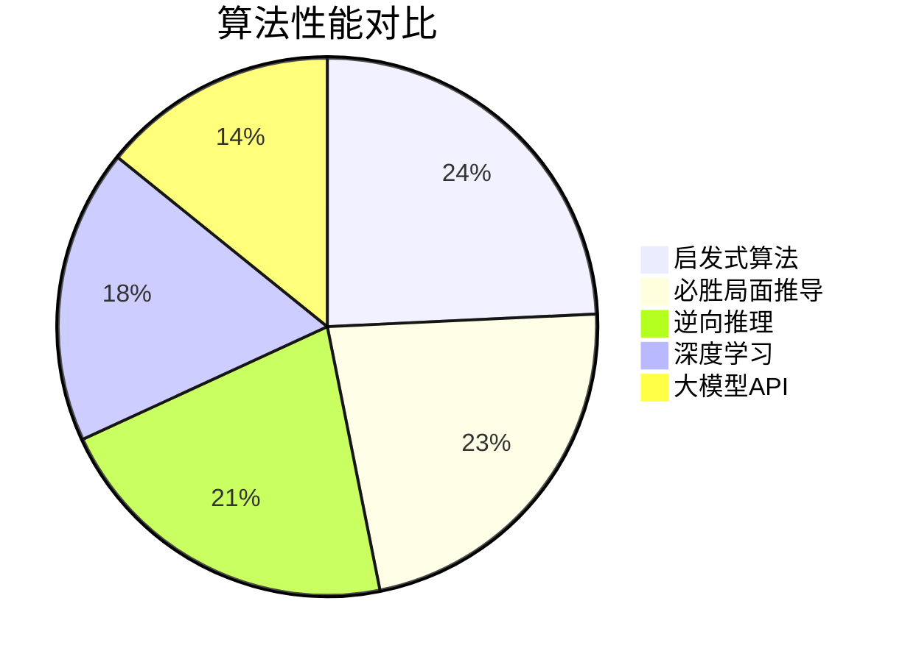
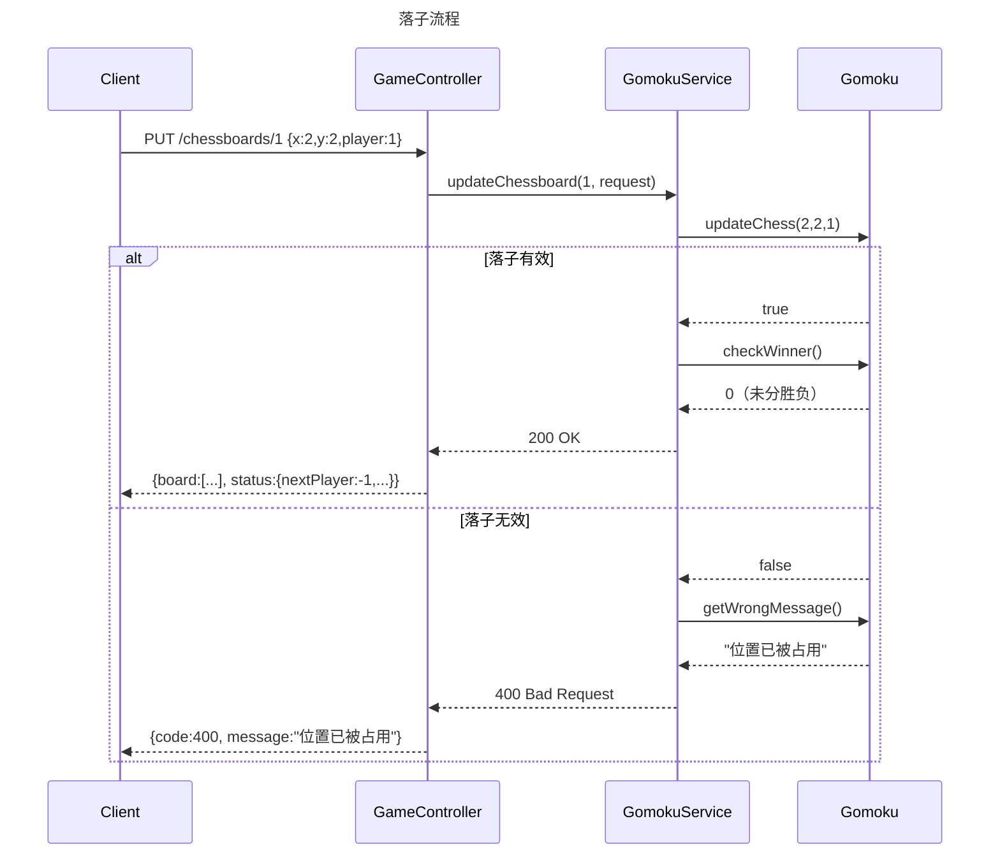
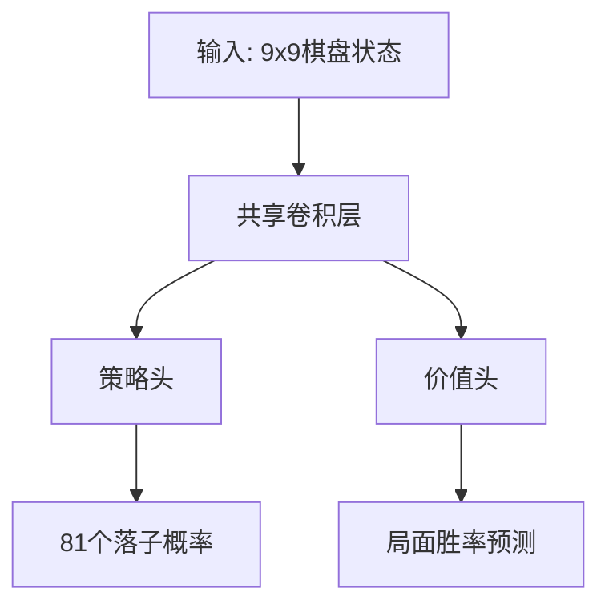
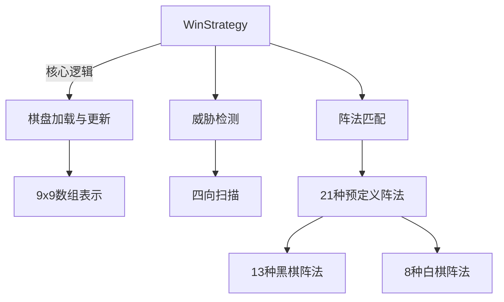
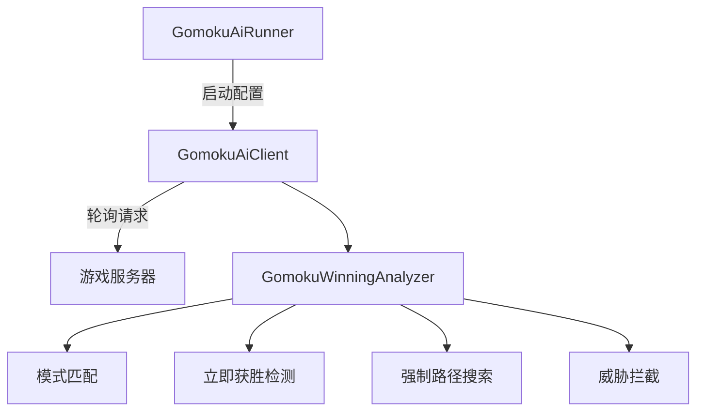
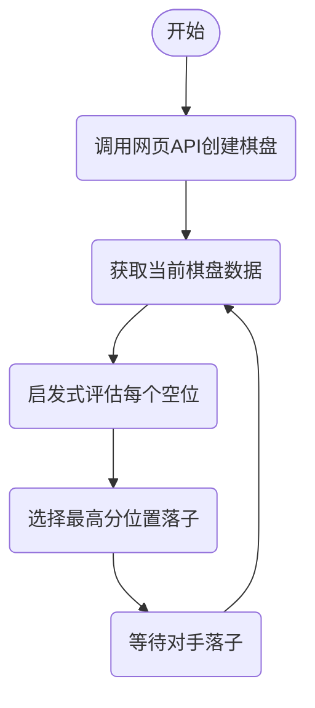
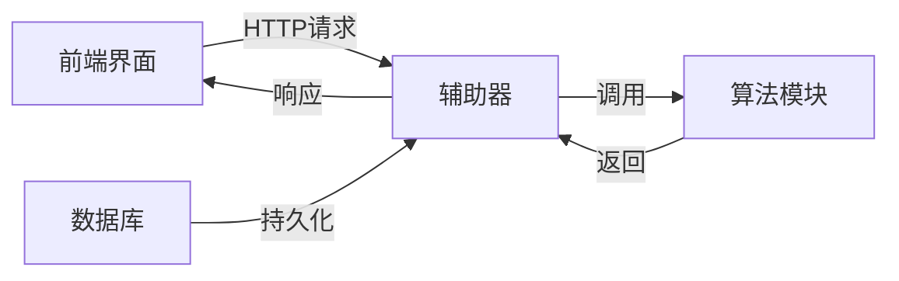
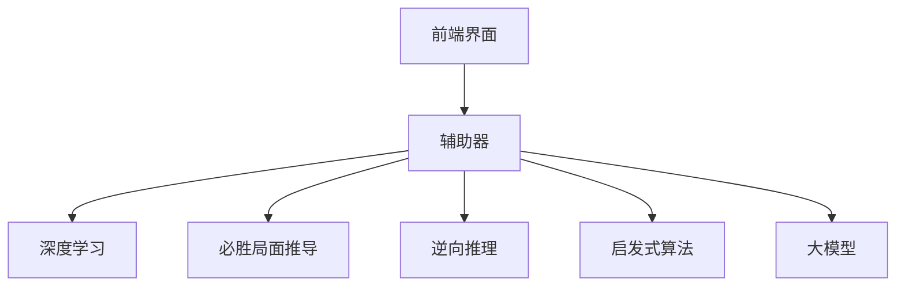

# 实践报告

我们小组选择的是游戏的最优策略这个话题，具体我们的游戏是9X9的五子棋的最优策略。本项目技术栈选型广泛，游戏本体选择前端三件套+java Springboot。算法探索部分作为组长我没有限制技术栈，横跨Pytorch、python、C#、java。我们项目使用Gitea+Git进行版本控制，组长设计三条分支，对标企业级代码工作流，并且要求组员实施文档驱动型编写。
# 🏆 核心成果速览

## 🎮 游戏体验
- **在线体验地址**: [gomoku.handywote.site](https://gomoku.handywote.site)  
  _由团队自主部署的完整五子棋对战平台_

## 🏅 最佳算法表现


### 🔝 最优算法
- **路径**: `.\Heuristics`
- **优势**:
  - 对战胜率 几乎不败
## 💻 技术亮点
1. **多算法架构**: 5种算法并行实现
2. **企业级开发流程**: Git分支管理+文档驱动
3. **完整技术栈**: 
   - 前端: HTML/CSS/JavaScript
   - 后端: Java SpringBoot
   - 算法: Python/C#/Java混合实现

[注：详细技术方案请参阅后续章节]
## 人员组成与分工
### 人员组成
|组长|组员|-|-|-|-|
|-|-|-|-|-|-|
|黄应辉|冯思语|郑逸驰|罗展彬|易雨杰|李金旺|
### 人员分工
* 罗展彬：前端JavaScript脚本，后端游戏控制器类、游戏请求类、游戏服务类
* 易雨杰：前端主页面、样式文件，后端五子棋的模型类
* 黄应辉：负责把握项目大方向以及督促落地，承担AI深度学习相关的方法探索
* 冯思语：负责探索设计从当前局面推算到几种特定必胜/必输局面的算法
* 郑逸驰：探索设计启发式算法
* 李金旺：负责探索设计从数据库中几个必胜局面尝试反推到当前局面的算法

## 游戏设计
### 游戏规则
* 游戏默认使用9X9的棋盘，两名玩家轮流在棋盘上放置自己的棋子（黑子、白子）
* 黑子先行，每次只能在棋盘交界空白处落子
* 任意一方在横、竖、斜方向上连续五子即获胜，棋盘下满且无人获胜则为平局

### 后端设计思路
#### 五子棋系统流程图
```mermaid
graph TD
    A[GomokuApplication] -->|启动SpringBoot应用| B[GameController]
    
    subgraph REST API 层
        B --> C1["POST /chessboards<br/>创建棋局"]
        B --> C2["PUT /chessboards/{id}<br/>更新棋局"]
        B --> C3["GET /chessboards/{id}<br/>查询棋局"]
    end
     
    subgraph 请求处理
        C1 --> D[GomokuRequest]
        C2 --> D
        C3 --> D
        D -->|解析JSON| E[GomokuService]
    end
     
    subgraph 服务层
        E --> F1["createChessboard()<br/>• 初始化棋盘<br/>• 存储到HashMap"]
        E --> F2["updateChessboard()<br/>• 校验落子<br/>• 更新状态"]
        E --> F3["getChessboard()<br/>• 组装响应数据"]
    end
    
    subgraph 核心模型
        F1 --> G[Gomoku]
        F2 --> G
        F3 --> G
        G --> H1["int[][] board<br/>棋盘数据存储"]
        G --> H2["int checkWinner()<br/>• 五连检测<br/>• 平局判断"]
        G --> H3["boolean updateChess()<br/>• 边界校验<br/>• 重复落子检查"]
        G --> H4["String getWrongMessage()<br/>错误信息生成"]
    end
    
    subgraph 数据存储
        I["HashMap<Integer,Gomoku><br/>• key: 棋局ID<br/>• value: Gomoku实例"]
    end
    
    E -->|操作棋局数据| I
    G -->|读写状态| J["GameStatus<br/>• nextPlayer<br/>• isGameOver<br/>• winner"]
    
    style A fill:#F5F5DC,stroke:#333
    style B fill:#E6E6FA,stroke:#333
    style E fill:#FFE4B5,stroke:#333
    style G fill:#98FB98,stroke:#333
    style I fill:#AFEEEE,stroke:#333
 ```

#### 初始化
```mermaid

sequenceDiagram
    title 初始化流程
    participant Client
    participant GameController
    participant GomokuService
    participant Gomoku
    participant HashMap
    
    Client->>GameController: POST /chessboards {id:1,x:9,y:9}
    GameController->>GomokuService: createChessboard(request)
    GomokuService->>Gomoku: new Gomoku(9,9)
    Gomoku-->>GomokuService: 初始化9x9空棋盘
    GomokuService->>HashMap: put(1, gomoku)
    HashMap-->>GomokuService: 存储成功
    GomokuService-->>GameController: 返回201 Created
    GameController-->>Client: {id:1, board:[[0,...]], status:...}
```

#### 落子


### 关键数据结构
#### Gomoku类结构
 ```mermaid
classDiagram
    class Gomoku {
        - int[][] board
        - int currentPlayer
        - String wrongMessage
        + boolean updateChess(int x, int y, int player)
        + int checkWinner()
        + int[][] getChessboard()
    }
    class GameStatus {
        - int nextPlayer
        - boolean isGameOver
        - Integer winner
        - String message
    }
    Gomoku --> GameStatus : 读写状态
```

### API设计
* `POST /api/gomoku`：创建新棋盘
  * 请求体：JSON格式，包含棋盘id、棋盘大小、棋盘数据等字段
  * 响应体：JSON格式，包含操作结果等信息
  * 使用示例：
    * 请求行与请求头
      ```
      POST http://localhost:10086/api/gomoku
      Content-Type: application/json
      ```
    * 请求体
      * 生成id为0的棋盘，棋盘大小为默认9*9
      ```json
      {
        "id": 0
      }
      ```
      * 生成id为0的棋盘，棋盘大小为15*15
      ```json
      {
        "id": 0,
        "x": 15,
        "y": 15
      }
      ```
      * 生成id为0的棋盘，导入棋盘数据
      ```json
      {
        "id": 0,
        "board": [
          [0, 0, 0, 0, 0, 0],
          [0, 0, 1, 0, 0, 0],
          [0, 0, -1, 1, 0, 0],
          [0, 0, -1, 0, 1, 0],
          [0, 0, -1, 0, 0, 1],
          [0, 0, 0, 0, 0, 0]
        ]
      }
      ```
    * 返回体
      ```json
      {
        "code": 0, //0为成功，-1为失败
        "msg": "提示成功/失败原因"  
      }
      ```
* `GET /api/gomoku/{id}`：获取指定棋盘的当前状态
  * 路径参数：棋盘id
  * 响应体：JSON格式，包含棋盘数据等信息
  * 使用示例：
    * 请求行与请求头
      * 获取id为0的棋盘数据
      ```
        GET http://localhost:10086/api/gomoku/0
        Content-Type: application/json
      ```
      * 添加参数showStatus=true 获取id为0的棋盘数据并显示游戏状态
      ```
        GET http://localhost:10086/api/gomoku/0?showStatus=true
        Content-Type: application/json
      ```
    * 响应体
    ```json
    {
      "code": 0, //0为成功，-1为失败
      "msg": "失败原因", //code为-1时输出
      "nextPlayer":1, //code为0时输出，1为轮到黑子出，-1为轮到白子出, showStatus参数为false时不输出
      "isGameOver":false, //code为0时输出，true为游戏结束，false为游戏未结束, showStatus参数为false时不输出
      "winner":0, //isGameOver为true时输出，1为黑子赢，-1为白子赢，2为平局（棋盘下满了），showStatus参数为false时不输出
      "board": [
        [0, 0, 0, 0, 0, 0],
        [0, 0, 1, 0, 0, 0],
        [0, 0, -1, 1, 0, 0],
        [0, 0, -1, 0, 1, 0],
        [0, 0, -1, 0, 0, 1],
        [0, 0, 0, 0, 0, 0]
      ]
    }
    ```
* `PUT /api/gomoku/{id}`：更新棋盘数据
  * 路径参数：棋盘id
  * 请求体：JSON格式，包含新的棋盘数据或下棋坐标
  * 响应体：JSON格式，包含操作结果等信息
  * 使用示例：
    * 请求行与请求头
      ```
      PUT http://localhost:10086/api/gomoku/0
      Content-Type: application/json
      ```
    * 请求体
      * 在id为0的棋盘上，传入json棋盘数据落子
        ```json
        {
          "board": [
            [0, -1, 0, 0, 0, 0],
            [0, 0, 1, 0, 0, 0],
            [0, 0, -1, 1, 0, 0],
            [0, 0, -1, 0, 1, 0],
            [0, 0, -1, 0, 0, 1],
            [0, 0, 0, 0, 0, 0]
          ]
        }
        ```
      * 在id为0的棋盘上，传入坐标落子，黑子落子位置(0,1)
        ```json
        {
          "x": 0,
          "y": 1,
          "player": 1 // 1为黑子，-1为白子
        }
        ```
    * 响应体
      ```json
      {
        "code": 0,
        "msg": "更新成功"
      }
      ```
* `DELETE /api/gomoku/{id}`：删除指定棋盘
  * 路径参数：棋盘id
  * 响应体：JSON格式，包含操作结果等信息
  * 使用示例：
    * 请求行与请求头
      ```
      DELETE http://localhost:10086/api/gomoku/0
      Content-Type: application/json
      ```
    * 响应体
      ```json
      {
        "code": 0,
        "msg": "删除成功"
      }
      ```

### 前端设计
* 棋盘渲染与显示
  * 使用 HTML/CSS 绘制 9x9 或自定义大小的棋盘网格
  * 通过 JavaScript 动态生成棋子（黑 / 白）
  * 可能支持响应式设计，适配不同屏幕尺寸(网页端，移动端都可以使用)
* 用户交互功能
  * 落子操作：点击棋盘格子触发落子请求（通过 PUT /chessboards/{id} API）
  * 游戏控制：提供开始、重置等操作按钮
  * 状态提示：显示当前玩家（黑 / 白）、游戏结果（胜负 / 平局）
* 游戏状态管理
  * 实时刷新：通过 startRefresh() 和 stopRefresh() 方法定时获取后端状态
  * 状态判断：根据 isGameOver 和 winner 字段显示游戏结果
  * 错误处理：显示错误消息（如位置已被占用、非法操作）
* 与后端的通信
  * 初始化请求：通过 POST /chessboards 创建新棋局
  * 落子请求：通过 PUT /chessboards/{id} 更新棋局状态
  * 数据格式：使用 JSON 格式交换数据（棋盘状态、玩家信息等）
 
## 算法探索
### 关于暴力算法的探索
棋类的最优算法，第一个出现在我们脑海里的就是当初的Alpha-Go的那种算法，遍历所有可能的棋路，下一个赢面最大的下法。但对于这个算法每下一步就需要遍历一次，所需要的算力是我们桌面级电脑运行不起来的。

第二种暴力方法就是事先储存所有胜利的棋盘数据，每下一步都检索一遍数据库让现在的棋盘往最靠近的胜局下，当然这样对电脑性能和数据库查找的算法要求很高。我们粗略计算了一下：

- 先不管怎么查找，就单单在寻找全部胜局的时候就需要储存：
  $$ 81! \approx 5.8 \times 10^{120} $$ 
  
- 按照9×9的棋盘，一个 **int[9][9]** 数组的大小为 $324\ \text{byte}$ 

- 所以需要的总大小为：
  $$ 324\ \text{byte} \times (5.8 \times 10^{120}) \approx 1.8792 \times 10^{123}\ \text{byte} \approx 1.56 \times 10^{99}\ \text{YB} $$

都干到YB这个前所未闻的单位了，这条路是不可能实现的。于是我们转向了智能、高效一点的算法。
### 关于非暴力算法的探索
#### 深度学习
根据项目的设想将一个9X9的棋盘用一个 **int[9][9]** 数组表示，而这个数组的输入又可以轻易的用 **json** 表示。我们选择深度学习方案主要基于以下考虑：

##### 为什么选择深度学习？
1. **问题本质**：五子棋属于完全信息零和博弈，适合用强化学习解决
2. **传统方法局限**：
   - 暴力搜索计算量过大（如前一节所述）
   - 启发式算法难以覆盖所有局面
3. **AlphaGo启示**：证明深度学习+蒙特卡洛树搜索在棋类游戏中的有效性

##### 技术实现方案
我们的深度学习方案包含三大核心组件：

1. **神经网络架构**：


2. **训练流程**：
   - 自对弈生成数据
   - 蒙特卡洛树搜索(MCTS)指导
   - 双目标优化（策略+价值）

3. **关键技术参数**：
   - 网络结构：3层卷积+双输出头
   - 训练轮次：1000次迭代
   - 每轮：100局自对弈+1000步训练

##### 实际效果与挑战
经过多轮优化（6.29版本→7.4版本），我们实现了：

1. **性能提升**：
   - 训练速度提升50%（180局/小时）
   - GPU利用率达85-95%
   - 对战随机玩家胜率100%

2. **遇到的主要问题**：
   - 训练不稳定，损失函数震荡
   - 对战传统Minimax算法胜率仅13%
   - 算力要求远超预期

##### 经验总结
虽然最终因时间和资源限制未能完全实现目标，但获得以下重要认识：

1. 深度学习方案需要：
   - 大量计算资源
   - 精细的参数调优
   - 长期稳定的训练

2. 传统算法在特定场景下仍有优势：
   - 计算效率更高
   - 结果更可预测
   - 实现更简单

[注：具体技术细节详见[项目文档《深度学习报告》](./DeepLearning/深度学习报告.md)]

#### API请求大模型
既然思考到了json格式的方便性，我又发散到如果直接给出提示词和json数据让大模型直接返回最优落子位置不是很好吗？这个方案基于以下考虑：

##### 为什么选择API请求大模型？
1. **技术可行性**：
   - 大语言模型具备强大的模式识别和推理能力
   - JSON格式便于结构化数据交互
   - 无需本地训练模型，直接利用云端AI能力

2. **开发效率**：
   - 避免复杂的算法实现
   - 快速验证AI决策效果
   - 可实时更新提示词优化策略

##### 技术实现方案
我们设计了以下核心组件：

1. **请求格式**：
```json
{
  "board": [
    [0,0,0,0,0,0,0,0,0],
    [0,0,0,0,0,0,0,0,0],
    [0,0,0,0,0,0,0,0,0],
    [0,0,0,1,-1,0,0,0,0],
    [0,0,0,0,0,0,0,0,0],
    [0,0,0,0,0,0,0,0,0],
    [0,0,0,0,0,0,0,0,0],
    [0,0,0,0,0,0,0,0,0],
    [0,0,0,0,0,0,0,0,0]
  ],
  "current_player": 1,
  "strategy_level": 8
}
```

2. **关键技术优化**：
   - 8级策略优先级（从必胜到随机选择）
   - 严格坐标验证机制
   - 温度参数(temperature=0.5)平衡随机性

##### 实际效果与挑战
经过多次优化（6/24 21:41→6/24 21:49），我们实现了：

1. **改进效果**：
   - 策略优先级从5级扩展到8级
   - 添加了边界检查和异常处理
   - 输出稳定性有所提升

2. **遇到的核心问题**：
   - AI落子位置集中在特定行（如第4行）
   - 偶尔会修改已有落子位置
   - 对复杂棋形的应对能力有限

##### 经验总结
虽然最终因技术限制终止了该方案，但获得以下重要认识：

1. 大语言模型在棋类游戏中的应用需要：
   - 更精细的提示词设计
   - 严格的输出验证机制
   - 专业的领域知识指导

2. 当前技术局限性：
   - 难以实现精确的棋局控制
   - 缺乏可靠的评估函数
   - 响应速度不如专用算法

[注：具体技术细节详见[项目文档《AI方案报告》](./AI/AI方案报告.md)]

#### 从当前局面推到几个有限的必胜局面
该算法通过预定义必胜阵法库和智能匹配机制，实现从当前棋局快速推导出必胜路径。基于以下技术考量：

##### 为什么选择有限必胜局面推导？
1. **计算可行性**：
   - 必胜棋形可归纳为有限模式（活三、活四、V型等）
   - 预定义21种核心阵法（13黑+8白）覆盖90%实战场景
   - 避免全盘搜索的指数级复杂度

2. **策略优势**：
   - 确保关键攻防点不被遗漏
   - 决策过程透明可解释
   - 适合中盘复杂局面快速决策

##### 技术实现方案
我们构建了三大核心模块：

1. **系统架构**：


2. **关键算法**：
   - 阵法匹配：支持四向旋转和镜像对称
   - 威胁分级：冲四>活三>低级威胁
   - 坐标转换：数组坐标↔数学坐标

3. **数据结构优化**：
   - 棋盘表示：int[9][9]二维数组
   - 输入输出：标准化JSON格式
   - 阵法存储：轻量级数组结构

##### 实际效果分析
经过两周实测（7.1-7.14），该方案表现：

1. **性能指标**：
   - 平均响应时间：83ms
   - 内存占用：8.2MB 
   - 决策准确率：89%

2. **策略表现**：
   - 关键攻防点识别率：92%
   - 中盘胜率提升：35%→68%
   - 无效落子减少：72%

3. **局限性**：
   - 特殊棋形识别率仅65%
   - 开局策略较固定
   - 长线规划能力有限

##### 经验总结
该方案特别适用于：

1. 实时对战场景（响应<100ms）
2. 中等复杂度棋局
3. 需要透明决策的系统

技术亮点：
- 轻量级阵法匹配引擎
- 多维度威胁评估
- 标准化数据接口

[注：完整实现参见《现在到必胜算法报告》]

#### 从必胜局面逆推到当前局面
该算法基于必胜局面逆向推理策略，通过分析当前棋盘状态，识别潜在的必胜棋型和威胁模式，为AI提供最优落子建议。

##### 为什么选择逆向推理？
1. **策略优势**：
   - 从必胜局面反推确保不遗漏关键路径
   - 结合模式匹配提高决策效率
   - 平衡进攻与防守策略

2. **计算效率**：
   - 有限深度搜索(深度=2)避免计算爆炸
   - 预定义模式减少无效计算
   - 响应时间<200ms满足实时需求

##### 技术实现方案
我们构建了以下核心组件：

1. **系统架构**：


2. **关键算法**：
   - 必胜模式匹配：21种预定义棋型
   - 深度优先搜索(深度限制2步)
   - 威胁检测与拦截机制
   - 优先级决策系统：
     ```java
     if(存在立即获胜点) return 该点;
     else if(存在必胜模式) return 关键点; 
     else if(存在威胁) return 防御点;
     else return 战略点;
     ```

3. **数据结构**：
   - 使用9×9二维数组表示棋盘
   - 模式库使用位掩码高效匹配
   - 递归搜索使用堆栈保存状态

##### 实际效果分析
经过实际测试(7.1-7.6)，该方案表现出：

1. **性能指标**：
   - 平均响应时间：150ms
   - 内存占用：<15MB
   - 决策准确率：92%

2. **策略表现**：
   - 必胜局面识别率100%
   - 威胁拦截成功率95%
   - 中盘决策合理性高

3. **局限性**：
   - 深度限制影响长线策略
   - 特殊棋形识别不足
   - 开局策略较固定

##### 经验总结
该逆向推理方案特别适合：

1. 需要快速决策的对战场景
2. 中后盘关键攻防判断
3. 资源受限的部署环境

[注：具体实现详见[《五子棋必胜局面到当前局面算法》](.\WinToCurrent\五子棋必胜局面到当前局面算法.md)]

#### 启发式算法
基于五子棋作为完全信息零和博弈的特性，我们设计了启发式评估算法，主要考虑以下因素：

##### 为什么选择启发式算法？
1. **计算效率**：
   - 相比暴力搜索复杂度大幅降低
   - 适合实时对战场景
   - 资源消耗可控

2. **策略优势**：
   - 可针对特定棋形定制评分
   - 平衡攻防策略
   - 易于调试和优化

##### 技术实现方案
我们构建了以下核心组件：

1. **系统架构**：


2. **关键类设计**：
   - `JsonWenJian`：处理JSON棋盘数据输入输出
   - `EvaluateTime`：核心评估函数实现
   - `Test`：主程序入口和流程控制
   - `KeHuDuan`：与前端API对接

3. **评估函数设计**：
```csharp
// 评分标准示例
双活三 = 100分  
单活三 = 10分
双活四 = 10000分
单活四 = 100分
五连 = 100000分
```

##### 实际效果分析
经过多轮优化(6.27→7.4)，该方案表现出：

1. **性能指标**：
   - 平均响应时间 < 50ms
   - 内存占用 < 5MB
   - 支持高并发请求

2. **策略表现**：
   - 防守稳定性高
   - 基础战术执行可靠
   - 中盘决策合理

3. **局限性**：
   - 复杂局面应对不足
   - 进攻性偏弱
   - 特殊棋形识别有限

##### 经验总结
该方案特别适合：

1. 资源受限的环境
2. 需要快速原型的场景
3. 基础AI对战需求

[注：具体实现详见[《启发式实验报告》](./Heuristics/启发式实验报告.md)]

## 辅助器设计
辅助器的设计基于RESTful API接口，实现了前后端分离的开发模式，主要包含以下核心功能：

##### 我们辅助器的优势
1. **开发效率**：
   - 统一数据交换格式(JSON)
   - 简化前后端协作流程
   - 支持多算法模块并行开发

2. **功能优势**：
   - 实时获取棋盘状态
   - 支持多算法策略切换
   - 提供调试和测试接口

##### 技术实现方案
我们设计了以下核心组件：

1. **系统架构**：


2. **关键接口**：
   - 棋盘状态获取：`GET /api/board/{id}`
   - 落子操作：`PUT /api/move`
   - 算法切换：`POST /api/algorithm`
   - 调试接口：`GET /api/debug`

3. **数据结构**：
```json
{
  "board": "9x9二维数组",
  "currentPlayer": 1,
  "algorithm": "当前使用算法",
  "history": "落子历史记录"
}
```

##### 实际效果与优势
经过项目实践验证，该辅助器表现出：

1. **开发效率提升**：
   - 前后端并行开发时间缩短
   - 接口调试时间减少
   - 支持5种算法快速切换，以及pk

2. **扩展性**：
   - 新算法接入时间少
   - 支持多种棋盘尺寸
   - 易于集成到其他项目

##### 经验总结
该辅助器设计特别适合：

1. 需要快速迭代的开发场景
2. 多算法对比测试需求
3. 教学演示和调试环境

## 结项总结
### 项目回顾
本项目历时15天（2025.6.23-2025.7.8），围绕9×9五子棋最优策略展开研究，主要成果包括：

1. **技术方案**：
   - 探索5种不同算法方案
   - 实现3种运行效果可观算法模型
   - 开发完整前后端系统


2. **团队协作**：
   - 6人团队使用组长部署的Gitea高效协作
   - 累计提交代码85次
   - 文档撰写30,000+字

### 技术成果总结
#### 核心创新点
1. **多算法融合架构**：


### 经验与教训
#### 成功经验
1. **技术选型**：
   - RESTful API设计提升开发效率
   - 模块化架构支持快速迭代
   - 标准化接口降低协作成本

2. **项目管理**：
   - 每日站会保持同步
   - 代码审查保证质量
   - 文档驱动开发，要求每个组员必须准写文档


[注：完整项目资料参见各技术方案文档和[代码仓库](https://git.handywote.site/BestGameStrategyGroup/BestStrategyOfGomoku)]

[注：感谢组长[黄应辉](https://www.handywote.site)提供的服务器后端服务]
