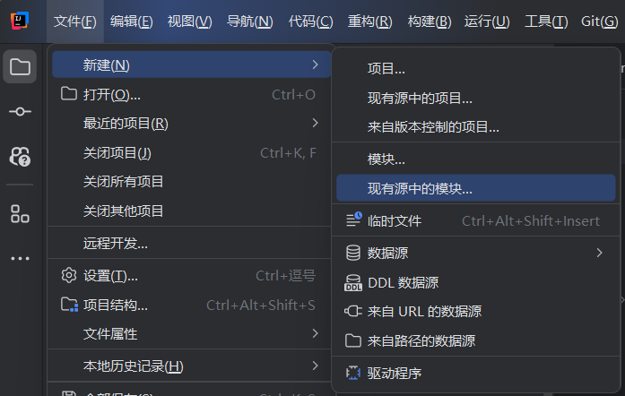
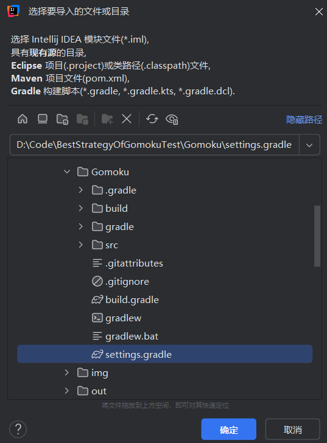
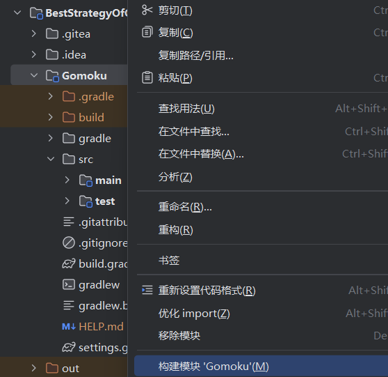
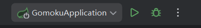
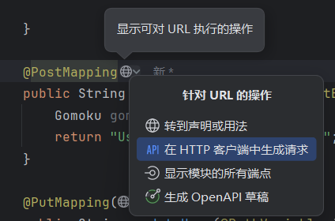

# 游戏本体

## 模块

* 主应用程序类 `GomokuApplication.java`
  * main函数启动程序
* 游戏控制器类（尝试通过RESTful API[^1]实现，实现不了再换成控制台或文件操作） `GameController.java`
  * `private Map<Integer, Gomoku> chessboards = new HashMap<>();`
  * json数据输入
    * 通过 RESTful API[^1] 输入数据并创建新的棋盘 `+ Object createChessboard(GomokuRequest body)`
      * `(int id)` id为棋局id，棋盘为默认9*9大小
      * `(int id,int x,int y)` id为棋局id, x、y为棋盘大小
      * `(int id,int[][] chessboard)` id为棋局id,传入导入的初始棋盘JSON
    * 通过 RESTful API[^1] 输入数据并通过五子棋模型类的方法落子 `+ Object updateChessboard(GomokuRequest body)`
      * `(int id,int x,int y,int player)` id为棋局id, x、y为落子位置，第一行第一列为(0,0)，player为1时黑子落子，-1时为白子落子
      * `(int id,int[][] chessboard)` 传入修改后的棋盘落子JSON
  * json棋盘输出
    * 通过 RESTful API[^1] 获取JSON数据 `+ Object getChessboard(int id, boolean showStatus)`
      * 棋盘数据  
      * 游戏状态 
        * 输出code、nextPlayer、isGameOver、winner(isGameOver==true时才输出)
        * showStatus参数用于控制是否显示游戏状态，默认为false
* 游戏请求类 `GomokuRequest.java`
  * 用于接收RESTful API[^1]请求的JSON数据
  * 包含棋盘id、棋盘大小、棋盘数据等字段
  * 提供构造函数和getter/setter方法
* 游戏服务类 `GomokuService.java`
  * 提供游戏逻辑处理方法
  * 包含创建棋盘、获取棋盘、更新棋盘等方法
  * 使用 `@Service` 注解标记为服务类
* 五子棋的模型类 `Gomoku.java`
  * 数组存储棋盘数据（可自定义棋盘大小，默认9*9） `Gomoku()` `Gomoku(int x,int y)` `Gomoku(int[][] board)`
  * 获取游戏状态 
    * 判断胜负  `int checkWinner()` 输出1为黑子赢，-1为白子赢，0为胜负未分，2为平局（棋盘下满了）
    * 轮到谁出  `int checkPlayerNow()` 输出1为轮到黑子出，-1为轮到白子出，先用成员变量存储应该轮到谁出棋或上一步是那一方出的，然后做判断
  * 获取棋盘：`int [][] getChessboard()` 输出数组
  * 落子：修改数组（修改前先判断数据输入是否符合游戏规则） 输出结果落子成功true/失败false
    * `boolean updateChess(int x,int y,int player)` 传入落子位置和下子玩家
    * `boolean updateChess(int[][] board)` 传入修改后的棋盘数据
  * 获取错误信息：`String getWrongMessage()`

### 分工
* 罗展彬：主应用程序类、游戏控制器类、游戏请求类、游戏服务类
* 易雨杰：五子棋的模型类

### 棋盘表示
使用 `n×n` 整型数组表示棋盘状态：
- `0`：空白位置
- `1`：黑子落子
- `-1`：白子落子


**JSON棋盘状态输出**：
```json
{
  "code": 0, //0为成功，-1为失败
  "msg": "失败原因", //code为-1时输出
  "nextPlayer":1, //code为0时输出，1为轮到黑子出，-1为轮到白子出, showStatus参数为false时不输出
  "isGameOver":false, //code为0时输出，true为游戏结束，false为游戏未结束, showStatus参数为false时不输出
  "board": [
    [0, 0, 0, 0, 0, 0],
    [0, 0, 1, 0, 0, 0],
    [0, 0, -1, 1, 0, 0],
    [0, 0, -1, 0, 1, 0],
    [0, 0, -1, 0, 0, 1],
    [0, 0, 0, 0, 0, 0]
  ]
}
```

**数据输入返回值**：
```json
{
  "code": 0, //0为成功，-1为失败
  "msg": "提示成功/失败原因"  
}
```

## API使用示例
### 创建新的棋盘
```
POST http://localhost:8080/api/gomoku
Content-Type: application/json
```
* 生成id为0的棋盘，棋盘大小为默认9*9
```
{ 
"id": 0
}
```
* 生成id为0的棋盘，棋盘大小为15*15
```
{
"id": 0
"x": 15,
"y": 15
}
```
* 生成id为0的棋盘，导入棋盘数据
```
{
"id": 0,
"board": [
    [0, 0, 0, 0, 0, 0],
    [0, 0, 1, 0, 0, 0],
    [0, 0, -1, 1, 0, 0],
    [0, 0, -1, 0, 1, 0],
    [0, 0, -1, 0, 0, 1],
    [0, 0, 0, 0, 0, 0]
   ]
}
```
### 获取棋盘数据
* 获取id为0的棋盘数据
```
GET http://localhost:8080/api/gomoku/0
Content-Type: application/json
```
* 获取id为0的棋盘数据并显示游戏状态
```
GET http://localhost:8080/api/gomoku/0?showStatus=true
Content-Type: application/json
```
### 更新棋盘数据
```
PUT http://localhost:8080/api/gomoku/0
Content-Type: application/json
```
* 在id为0的棋盘上，黑子落子位置(0,0)
```
{
    "x": 0,
    "y": 0,
    "player": 1
}
```
* 在id为0的棋盘上，传入json棋盘数据落子
```
{
"board": [
    [1, 0, 0, 0, 0, 0],
    [0, 0, 0, 0, 0, 0],
    [0, 0, 0, 0, 0, 0],
    [0, 0, 0, 0, 0, 0],
    [0, 0, 0, 0, 0, 0],
    [0, 0, 0, 0, 0, 0]
   ]
}
```
### 删除棋盘
```
DELETE http://localhost:8080/api/gomoku/0
Content-Type: application/json
```

## 如何构建Spring Boot
1. 安装 JDK 17 ，配置好环境变量
2. 新建模块，步骤如下图




3. 右键 Gomoku 模块（文件夹），点击构建模块（如有报错可以尝试询问大模型解决）



4. 构建完成后右上角出现如下图的运行按钮，点击运行即可，



5. 运行成功后可到浏览器 localhost:8080 测试/查看 RESTful API 接口
6. 或者使用 IntelliJ IDEA 内置工具等测试 RESTful API 接口



---
## 参考资料
对于JSON在JAVA中的使用，可以参考 https://www.runoob.com/w3cnote/java-json-instro.html

实现一个简单的RESTful API，可以参考 https://www.cnblogs.com/happy-coding/p/18705679

[^1]: https://www.cnblogs.com/happy-coding/p/18705679 